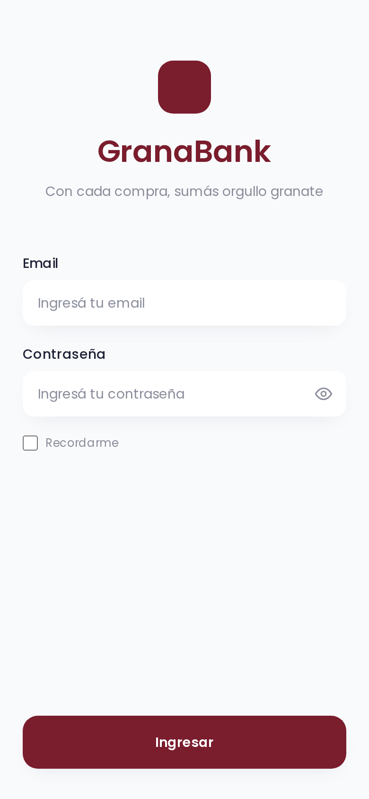
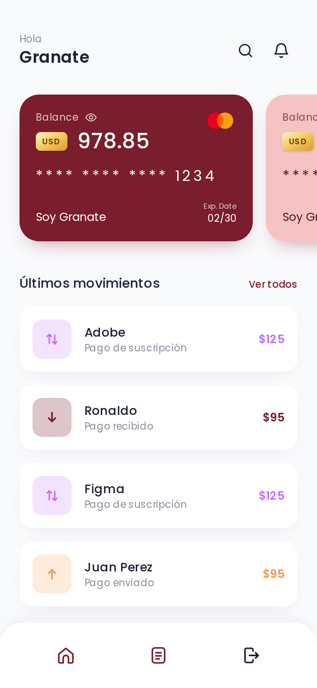
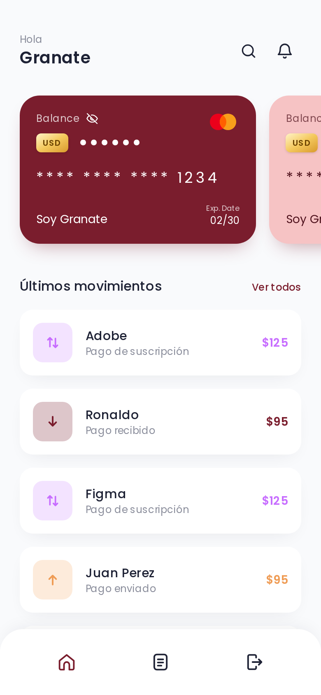
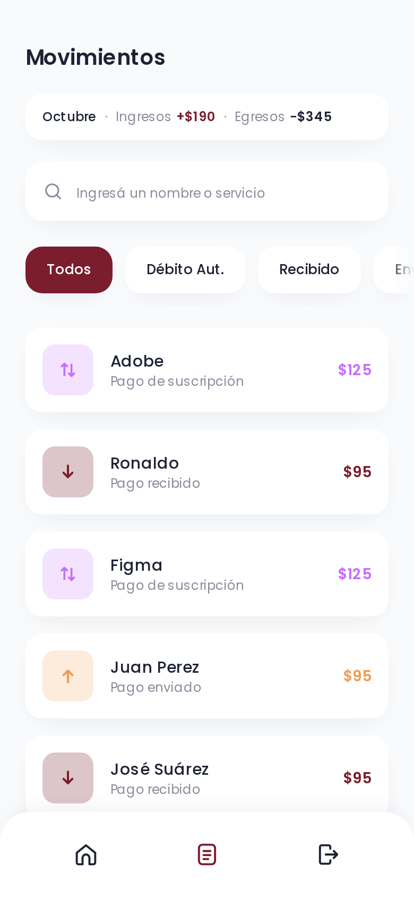
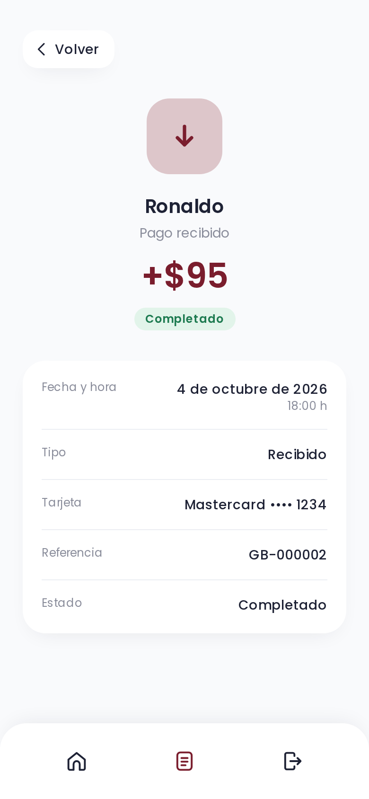

# GranaBank

Home banking mobile-first para el challenge técnico del Club Atlético Lanús: login, saldo de tarjetas (que se puede ocultar), movimientos con búsqueda, filtros y resumen del mes, y detalle de cada movimiento, construido a partir del diseño de Figma.

| Login                                | Home                               | Saldo oculto                                              | Movimientos                                    | Detalle                                          |
| ------------------------------------ | ---------------------------------- | --------------------------------------------------------- | ---------------------------------------------- | ------------------------------------------------ |
|  |  |  |  |  |

Animaciones en video (390×844, build de producción): [`docs/screenshots/premium-demo.webm`](docs/screenshots/premium-demo.webm) — tarjeta con inclinación 3D, saldo tipo odómetro, header y barra de vidrio. Capturas: [Home](docs/screenshots/premium-home.png), [Home con scroll](docs/screenshots/premium-home-scrolled.png), [Movimientos con scroll](docs/screenshots/premium-movements-scrolled.png). Video anterior: [`motion-demo.webm`](docs/screenshots/motion-demo.webm).

## Demo

Deploy: _pendiente_

**Credenciales de prueba:** `soygranate@clublanus.com` / `GRANATE1@`

## Stack

- **Next.js 16** (App Router, Server Components, Server Actions) + **TypeScript** estricto
- **PostgreSQL 17** + **Prisma 7** (driver adapter `@prisma/adapter-pg`)
- **Tailwind CSS v4**, tipografía Poppins
- **Motion** (motion.dev, sucesor de Framer Motion) para resortes, valores ligados al scroll y animaciones de layout
- **zod** (validación compartida cliente/servidor), **jose** (JWT), **bcryptjs**
- **Vitest** + Testing Library, **Playwright**, GitHub Actions

## Cómo correrlo

Requisitos: **Node 22+**, **pnpm**, **Docker**.

```bash
pnpm install              # también genera el cliente de Prisma
cp .env.example .env      # en producción, generar SESSION_SECRET con: openssl rand -base64 32
pnpm db:up                # PostgreSQL en Docker (puerto 5432)
pnpm db:migrate           # aplica las migraciones
pnpm db:seed              # 2 usuarios demo, tarjetas, 27 movimientos y 1 transferencia (idempotente)
pnpm dev                  # http://localhost:3000
```

Puertos: app `3000`, PostgreSQL `5432`, servidor de los tests e2e `3100`.

**Probarlo desde el celular (misma Wi‑Fi):** Next bloquea en dev los assets pedidos desde otro host, así que hay que habilitar la IP de la máquina con `ALLOWED_DEV_ORIGINS` (lista separada por comas; solo aplica a `next dev`):

```bash
ALLOWED_DEV_ORIGINS=192.168.1.10 pnpm dev -H 0.0.0.0   # luego abrir http://192.168.1.10:3000
```

Si hay firewall, abrir el puerto 3000 solo para la red local. Con `next start` no sirve por `http://`: en producción la cookie de sesión es `Secure` y el navegador la descarta fuera de HTTPS (salvo en `localhost`).

## Scripts

| Script                               | Qué hace                                                 |
| ------------------------------------ | -------------------------------------------------------- |
| `pnpm dev` / `build` / `start`       | Servidor de desarrollo, build de producción y servidor   |
| `pnpm lint` / `typecheck` / `format` | ESLint, `tsc --noEmit` (con tipos de rutas), Prettier    |
| `pnpm format:check`                  | Verifica el formato sin modificar archivos               |
| `pnpm test` / `test:watch`           | Tests unitarios y de componentes (sin base de datos)     |
| `pnpm test:integration`              | Tests de integración contra PostgreSQL                   |
| `pnpm test:e2e`                      | Tests end-to-end con Playwright                          |
| `pnpm db:up`                         | Levanta PostgreSQL con Docker Compose                    |
| `pnpm db:migrate` / `db:deploy`      | `prisma migrate dev` / `prisma migrate deploy`           |
| `pnpm db:seed` / `db:reset`          | Carga los datos demo / resetea la base y vuelve a cargar |

## Estructura del proyecto

Organizada por funcionalidad ("screaming architecture"): las carpetas dicen qué hace la app, no qué framework usa.

```
src/
├── app/                 rutas delgadas: conectan features (páginas, error boundaries, API REST)
├── features/
│   ├── auth/            domain/ data/ server/ ui/
│   ├── movements/       domain/ data/ ui/
│   ├── account/         domain/ data/ server/ ui/
│   └── transfers/       domain/ data/ server/   (UI en camino)
├── shared/              lib/ (db, errores de API, fechas, formato, dinero exacto) · ui/ (Button, BottomNav…)
├── proxy.ts             protección optimista de rutas
└── test/                fixtures y repositorio en memoria
prisma/                  schema, migraciones y seed
e2e/                     Playwright
```

Cada feature usa las mismas capas, y solo las que necesita:

| Capa      | Contenido                                                                      |
| --------- | ------------------------------------------------------------------------------ |
| `domain/` | Reglas puras, casos de uso, schemas zod y tipos. No conoce Prisma ni React.    |
| `data/`   | Repositorios con Prisma que implementan los puertos del dominio.               |
| `server/` | Puntos de entrada solo de servidor: Server Actions, login, sesión.             |
| `ui/`     | Componentes. Server Components por defecto; Client solo donde hay interacción. |

Los tests viven al lado del código (`x.ts` + `x.test.ts`). Las dependencias van en una sola dirección: `ui` y `data` dependen de `domain`, nunca al revés.

## Decisiones técnicas

- **App Router + Server Components.** Las páginas leen la base en el servidor: no hay credenciales ni consultas en el navegador y se envía menos JavaScript. Client Components solo para formularios, búsqueda, "Cargar más" y el saldo (contador y ocultar).
- **API routes en lugar de un backend separado.** La consigna lo permite: un proyecto, un deploy, tipos compartidos. Las rutas REST reutilizan los mismos casos de uso que las páginas.
- **Prisma + PostgreSQL.** Tipos generados desde el schema y migraciones versionadas. Para la búsqueda se usa SQL parametrizado (`Prisma.sql`), probado contra una base real.
- **Montos `Decimal(12,2)`**, que viajan como string (`"125.00"`): un `float` acumula errores de redondeo.
- **Sesión: JWT en cookie `httpOnly`**, `sameSite=lax` y `secure` en producción. `proxy.ts` hace un chequeo rápido del token y `requireUser()` vuelve a verificar al usuario en la base en cada lectura (defensa en profundidad).
- **Un schema zod por formulario/parámetro**, compartido entre cliente (feedback inmediato) y servidor (la validación real).
- **Filtros en la URL** (`?q=&type=`): se pueden compartir, sobreviven al recargar y funcionan con el botón atrás; el filtrado ocurre en la base. Búsqueda con debounce de 300 ms y `router.replace`.
- **Paginación por cursor** (`occurredAt` + `id`): estable aunque entren movimientos nuevos y aprovecha el índice `(userId, occurredAt)`.
- **Protección IDOR.** Toda consulta filtra por el `userId` de la sesión; un id ajeno responde el mismo 404 que uno inexistente.
- **Búsqueda sin acentos** con la extensión `unaccent` ("jose" encuentra "José"), escapando `%` y `_`.
- **404 real en el detalle.** El detalle no tiene `loading.tsx`, así el status no queda fijo en 200 antes de saber si el movimiento existe.
- **Zona horaria de Buenos Aires** para mostrar fechas: Vercel corre en UTC y un pago de las 22 h aparecería al día siguiente.
- **Ocultar saldo:** el ojo de la tarjeta principal enmascara los saldos de todas las tarjetas. La preferencia se guarda en una cookie (no en `localStorage`) que lee el servidor: un saldo oculto nunca se ve un instante al cargar y servidor y cliente renderizan lo mismo (sin _hydration mismatch_).
- **Resumen del mes en Movimientos:** "Octubre · Ingresos +$X · Egresos −$Y". Ingresos = recibidos; egresos = enviados + débitos automáticos; solo movimientos **completados** (un pendiente todavía puede fallar). Mes calendario de Buenos Aires (empieza a las 03:00 UTC). No depende de la búsqueda ni del filtro: describe el mes. La base suma los `Decimal` (`groupBy`) y la app solo los combina como centavos enteros, nunca como `float`.
- **Transferencias entre usuarios** (`src/features/transfers`): por alias o CVU (el CVU se valida con sus dígitos verificadores, como un CBU). Todo ocurre en **una sola transacción**: se reclama la clave de idempotencia, se debita, se acredita en la tarjeta principal del destinatario y se crean los dos movimientos (`SENT` y `RECEIVED`, enlazados a un `Transfer`); si algo falla, no queda nada a medias.
  - **Sin sobregiro con concurrencia:** el débito es un `UPDATE` condicional (`WHERE balance >= monto`). PostgreSQL bloquea la fila y reevalúa la condición con el saldo ya confirmado, así que de N transferencias simultáneas solo pasan las que alcanzan. Se eligió esto en lugar de `SERIALIZABLE`, que obligaría a reintentar ante cada conflicto sin dar más garantías para una invariante de una sola fila. Un `CHECK (balance >= 0)` en la base es la red de seguridad. Las dos tarjetas se actualizan siempre en el mismo orden (por id) para que A→B y B→A simultáneas no se bloqueen entre sí.
  - **Idempotencia:** el cliente manda un UUID por intento (`idempotencyKey`, único por emisor). Un reintento o doble toque con la misma clave devuelve la transferencia original (200, `replayed: true`) sin mover plata dos veces, incluso si las dos requests llegan a la vez; la misma clave con otros datos responde 409.
  - **Referencia legible:** cada transferencia recibe un código corto al azar en base32 de Crockford (`7Q4K-92XA`: 40 bits, sin `I`, `L` ni `O`, que se confunden con `1` y `0`, y sin `U`, para no formar palabras ofensivas por accidente). Los dos movimientos lo comparten con el lado como prefijo (`ENV-7Q4K-92XA` para quien envía, `REC-7Q4K-92XA` para quien recibe): cada referencia sigue siendo única en la base (índice único) y las dos personas citan el mismo código. Si un código ya existe, la transacción se repite con otro.
  - Los rechazos de negocio (saldo insuficiente, destinatario inexistente, a uno mismo, otra moneda) son valores de una unión discriminada, no excepciones, y responden 404/422 con mensaje en español.
- **Errores de API clasificados:** base caída → 503 (reintentable); bug → 500 genérico con log; `redirect()`/`notFound()` de Next se dejan pasar.

El razonamiento completo, tarea por tarea, está en [`docs/BITACORA.md`](docs/BITACORA.md).

## API

Todas las respuestas son JSON. Éxito: `{ "data": … }`. Error: `{ "error": { "code", "message", "details"? } }`, donde `code` es estable (`INVALID_INPUT`, `UNAUTHORIZED`, `NOT_FOUND`, `SERVICE_UNAVAILABLE`, …) y `details` trae los errores por campo.

| Método | Ruta                       | Auth   | Parámetros                                                                                  | Respuestas                                                                                                                                                                                   |
| ------ | -------------------------- | ------ | ------------------------------------------------------------------------------------------- | -------------------------------------------------------------------------------------------------------------------------------------------------------------------------------------------- |
| POST   | `/api/auth/login`          | —      | JSON `{ email, password, remember? }`                                                       | 200 `{ data: { userId } }` + cookie · 400 · 401 · 415 (no es JSON) · 500 · 503                                                                                                               |
| POST   | `/api/auth/logout`         | Cookie | — (rechaza otro `Origin`)                                                                   | 204 · 403                                                                                                                                                                                    |
| GET    | `/api/movements`           | Cookie | `q` (≤ 50), `type` (`debito`, `recibido`, `enviado`), `cursor`                              | 200 `{ data: Movement[], total, nextCursor }` · 400 · 401 · 503                                                                                                                              |
| GET    | `/api/movements/:id`       | Cookie | —                                                                                           | 200 `{ data: Movement }` · 401 · 404 (inexistente, mal formado o ajeno) · 503                                                                                                                |
| GET    | `/api/movements/summary`   | Cookie | `month` (`AAAA-MM`, por defecto el mes actual en Buenos Aires)                              | 200 `{ data: { month, currency, income, expenses } }` · 400 · 401 · 503                                                                                                                      |
| GET    | `/api/account/cards`       | Cookie | —                                                                                           | 200 `{ data: Card[] }` (principal primero) · 401 · 503                                                                                                                                       |
| GET    | `/api/account/receive`     | Cookie | —                                                                                           | 200 `{ data: { holderName, alias, cvu, cvuFormatted } }` · 401 · 404 · 503                                                                                                                   |
| GET    | `/api/transfers/recipient` | Cookie | `q` (alias o CVU)                                                                           | 200 `{ data: { fullName, alias, cvuMasked } }` · 400 · 401 · 404 · 422 (a uno mismo) · 503                                                                                                   |
| POST   | `/api/transfers`           | Cookie | JSON `{ recipient, amount, description?, cardId?, idempotencyKey }` (rechaza otro `Origin`) | 201 `{ data: Transfer }` con el saldo nuevo · 200 (reintento, `replayed: true`) · 400 · 401 · 403 · 404 · 409 · 415 · 422 (`INSUFFICIENT_FUNDS`, `SELF_TRANSFER`, `CURRENCY_MISMATCH`) · 503 |

```bash
curl -i -c cookies.txt -H 'content-type: application/json' \
  -d '{"email":"soygranate@clublanus.com","password":"GRANATE1@"}' \
  http://localhost:3000/api/auth/login
curl -b cookies.txt 'http://localhost:3000/api/movements?q=jose&type=recibido'
curl -b cookies.txt -H 'content-type: application/json' \
  -d "{\"recipient\":\"hincha.granate\",\"amount\":\"10.50\",\"idempotencyKey\":\"$(uuidgen)\"}" \
  http://localhost:3000/api/transfers
```

Hay un segundo usuario demo para probar transferencias en los dos sentidos: `hincha@clublanus.com` / `GRANATE2@` (alias `hincha.granate`). El alias del usuario principal es `soy.granate.lanus`. El seed incluye una transferencia vieja entre los dos (`ENV-SEED-0001`), así "Recientes" ya muestra a quién enviar.

## Testing

| Tipo        | Comando                 | Qué cubre                                                                                                                                                                                                                                                                                                                                                        | Cantidad |
| ----------- | ----------------------- | ---------------------------------------------------------------------------------------------------------------------------------------------------------------------------------------------------------------------------------------------------------------------------------------------------------------------------------------------------------------- | -------- |
| Unitarios   | `pnpm test`             | Dominio (validación, cursor, filtros, login, resumen mensual y límites del mes, transferencias: alias/CVU, montos exactos, reglas e idempotencia), rutas REST con repositorios en memoria, componentes desde lo que ve el usuario (odómetro del saldo, ocultar saldo, carrusel, header, navegación)                                                              | 457      |
| Integración | `pnpm test:integration` | SQL real: transferencias (atomicidad, sin sobregiro con N transferencias en paralelo, idempotencia, sin deadlock A↔B); búsqueda sin acentos, escape de `%`/`_`, filtro por tipo, aislamiento por usuario, paginación completa y desempates; errores reales de la base (credenciales, base inexistente, sin conexión); sumas del resumen mensual y bordes del mes | 40       |
| End-to-end  | `pnpm test:e2e`         | Login/logout, cookie y "Recordarme", búsqueda, filtros, "Cargar más", detalle, 404, estados vacíos, ocultar saldo, resumen del mes, animaciones y CLS < 0.05 en Home (con y sin movimiento reducido), transferencias y ninguna pantalla con scroll lateral ni texto cortado de 180 a 1024 px, en Chromium móvil                                                  | 46       |

Integración necesita la base levantada con las migraciones: crea y borra sus propios datos, así que no depende del seed. E2E necesita además el seed. La lógica se escribió mayormente con TDD (test que falla → código → refactor). CI (`.github/workflows/ci.yml`) corre lint, tipos, formato y unitarios, y en otro job, con un PostgreSQL de servicio: migraciones, seed, integración, build y e2e contra el build de producción.

## Accesibilidad y UX

- Navegable con teclado; foco visible; labels, `aria-invalid` y foco en el primer error del formulario.
- Regiones `role="status"` para resultados y carga; errores con `role="alert"`.
- Estados de carga (esqueletos), error con "Reintentar" y dos estados vacíos (sin movimientos / sin resultados).
- Mobile-first; en desktop, columna centrada como un teléfono.
- En el celular: inputs de 16px (iOS no hace zoom al enfocarlos), zoom del usuario habilitado, márgenes para el notch y la barra inferior (`viewport-fit=cover` + `env(safe-area-inset-*)`), ícono propio y color de la barra del navegador.
- Limitación conocida (diseño): el violeta de suscripción del diseño (`#C76DFF`) no llega a contraste AA en texto chico; se respetó el diseño.

## Movimiento y accesibilidad

La sensación "premium" sale de física, profundidad y continuidad, no de cambiar el diseño: se respetan el layout, los colores y la tipografía del Figma. Las interacciones físicas usan **Motion** (`motion/react`) con resortes; las transiciones simples siguen en CSS con los tokens `--motion-*` de `globals.css`. Solo se animan `transform`, `opacity` y `filter`, y lo que sigue al dedo o al scroll corre sobre _motion values_ (ningún `setState` por cuadro).

- **Tarjeta viva (Home):** al presionarla y arrastrar se inclina en 3D hacia el dedo (hasta 10°/12°, perspectiva 800px) y vuelve con un resorte al soltar. Un brillo suave se mueve con la inclinación y la sombra se desplaza al revés; la tarjeta principal recibe un barrido de luz una sola vez al montarse. La superficie tiene un degradé sutil para leerse como material (el granate `#7A1D2D` y el rosa de Visa siguen siendo los del diseño).
- **Carrusel:** el scroll sigue siendo nativo (scroll-snap: inercia, teclado, lectores de pantalla). Motion solo lee la posición del scroll y, cuadro a cuadro, achica (0,92) y atenúa la tarjeta no activa. Los puntos debajo son botones ("Tarjeta 1 de 2") que llevan a cada tarjeta; el activo se estira con un resorte.
- **Saldo tipo odómetro:** cada dígito es una tira 0–9 que rueda con resorte, de derecha a izquierda (40 ms entre dígitos), con cifras tabulares y celdas fijas: el ancho no cambia. Al ocultar el saldo los dígitos se desenfocan y aparecen los puntos (250 ms), y al mostrarlo vuelven a rodar. Los lectores de pantalla escuchan solo el valor final. No se repite al recargar: el HTML del servidor ya trae cada tira en su lugar.
- **Header de vidrio:** en Home y Movimientos el header queda fijo y se compacta con el scroll ("Hola" se desvanece, el título baja a 85%) y se vuelve vidrio esmerilado (`backdrop-filter: blur(16px) saturate(180%)`), con fondo casi opaco donde el navegador no lo soporta (`@supports`). No cambia de alto: se pega con un `top` negativo, así nada se mueve debajo (CLS 0). En Movimientos, el buscador y los chips quedan pegados debajo: son los controles de una lista larga, mientras que el resumen del mes (contexto) se va con el scroll.
- **Barra inferior:** también de vidrio. La sección actual tiene una píldora granate suave que viaja entre íconos con un resorte (un único elemento compartido con `layoutId`), y los íconos se achican con un resorte al tocarlos.
- **Lista → detalle:** el ícono del movimiento tocado se transforma en el del detalle (React `<ViewTransition>`), y vuelve a su fila con "Volver". Las filas entran escalonadas y los esqueletos tienen brillo, como antes.
  - La vuelta solo se anima si la lista aparece en el mismo _commit_ que la navegación: "Volver" la precarga (`prefetch`), y Next precarga **solo en producción**. En `next dev` la lista pasa primero por su esqueleto y no hay morph (el e2e de la vuelta corre con `CI=1`, sobre `next start`).
  - Con el botón atrás del navegador no hay morph: React restaura esa entrada del historial en una _lane_ síncrona y no inicia ninguna view transition (limitación del framework; un test fija el comportamiento actual y se pone en rojo cuando el framework empiece a animarlo). No se intercepta el historial para forzarlo.
- **Peso:** Motion se carga con `LazyMotion` y componentes `m.*`: la página trae el núcleo, y el paquete de gestos y layout (`domMax`, ~24 kB gzip) llega en un chunk aparte después de hidratar.
- **`prefers-reduced-motion: reduce`:** sin inclinación, sin barrido de luz, sin rodar el saldo (aparece final), sin escalado ligado al scroll y la píldora salta sin resorte; el vidrio y los fundidos de opacidad se mantienen. Hay tests e2e que lo verifican en ambos modos.

## Cómo ver los estados

Con la app corriendo e iniciada la sesión:

| Estado                      | Cómo verlo                                                                                                                                                                                                                                                         |
| --------------------------- | ------------------------------------------------------------------------------------------------------------------------------------------------------------------------------------------------------------------------------------------------------------------ |
| Sin resultados (búsqueda)   | En Movimientos, buscar `zzz`. Aparece "No encontramos movimientos para “zzz”" con "Limpiar filtros".                                                                                                                                                               |
| Sin resultados (con filtro) | Combinar búsqueda y filtro sin coincidencias, por ejemplo `/movimientos?q=adobe&type=recibido`.                                                                                                                                                                    |
| Sin movimientos             | Es el mensaje de una cuenta sin movimientos ("Todavía no tenés movimientos"). El usuario demo tiene 27, así que se prueba en `MovementsEmptyState.test.tsx`.                                                                                                       |
| Carga                       | DevTools → Network → throttling "Slow 4G". Desde Inicio, tocar Movimientos en la barra inferior: se ven los esqueletos. "Cargar más" muestra "Cargando…".                                                                                                          |
| Error                       | `docker stop granabank-db` y abrir Movimientos: aparece "No pudimos cargar tus movimientos" con "Reintentar". Después `docker start granabank-db` y tocar "Reintentar". Iniciar sesión antes de detener la base. ([captura](docs/screenshots/movements-error.png)) |
| No encontrado (404)         | Abrir `/movimientos/abc`.                                                                                                                                                                                                                                          |

## Qué mejoraría con más tiempo

- **Rate limiting del login** con Redis/Upstash (un límite en memoria no sirve en serverless).
- **Sesiones revocables** (tabla de sesiones o lista de revocación) para cerrar sesión en todos los dispositivos.
- **Índice trigram** (GIN sobre `unaccent`) para que la búsqueda escale con muchos datos.
- **Monitoreo** con Sentry o similar, usando el `digest` de los errores.
- **Deploy previews** por PR y e2e contra el preview.
- Contraste del violeta (consensuado con diseño), modo oscuro, i18n y soporte offline/PWA.

## Proceso de trabajo

Construido con asistencia de IA (Claude Code), bajo un protocolo propio: tareas chicas, tests primero, revisión de cada cambio antes de commitear y revisiones automáticas por enfoque (seguridad, resiliencia, legibilidad, confiabilidad). Cada decisión y su porqué quedó registrada en [`docs/BITACORA.md`](docs/BITACORA.md), y el historial usa commits chicos con Conventional Commits.
