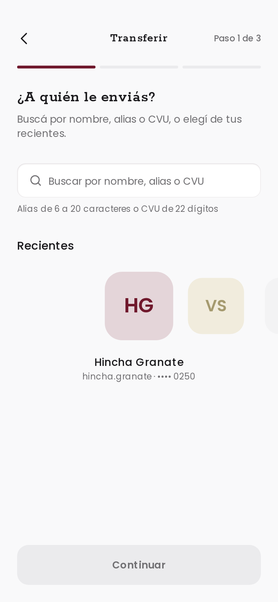
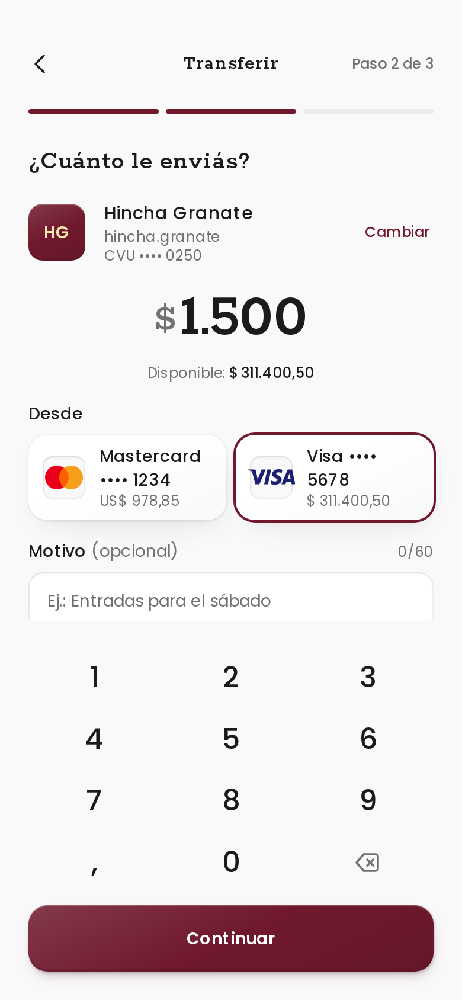
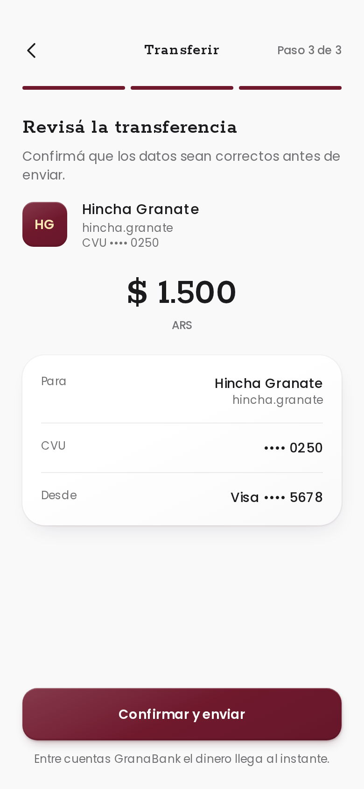
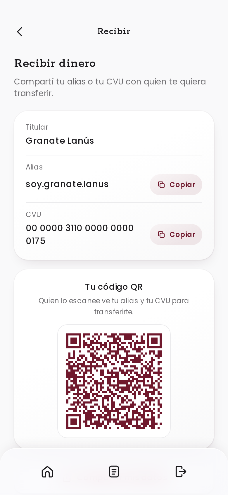
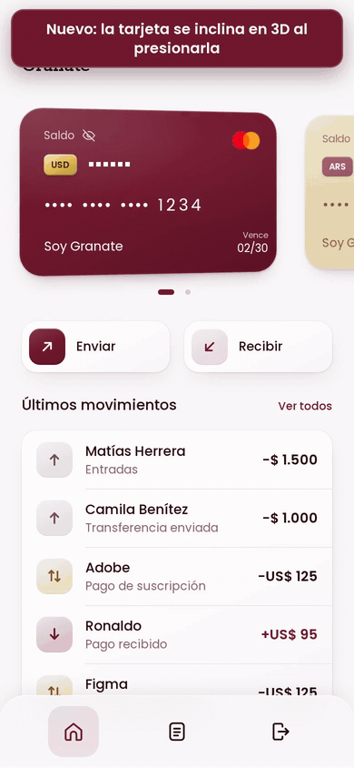
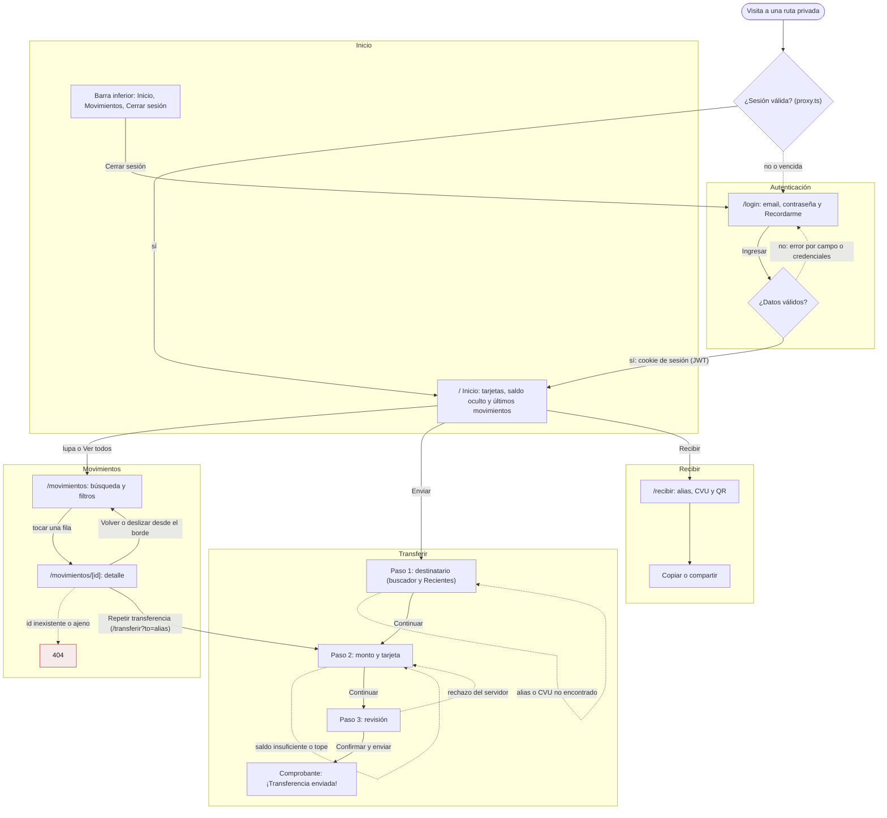
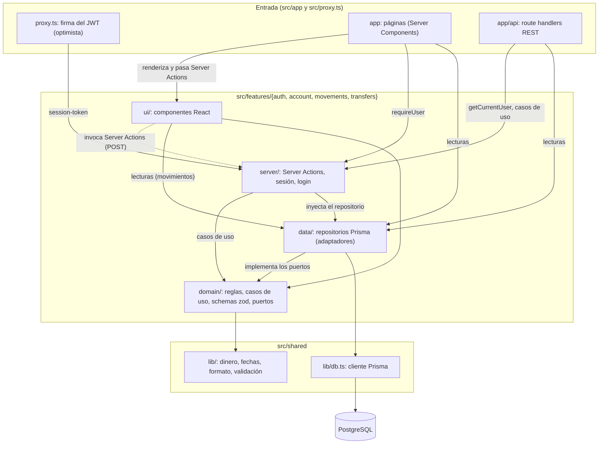
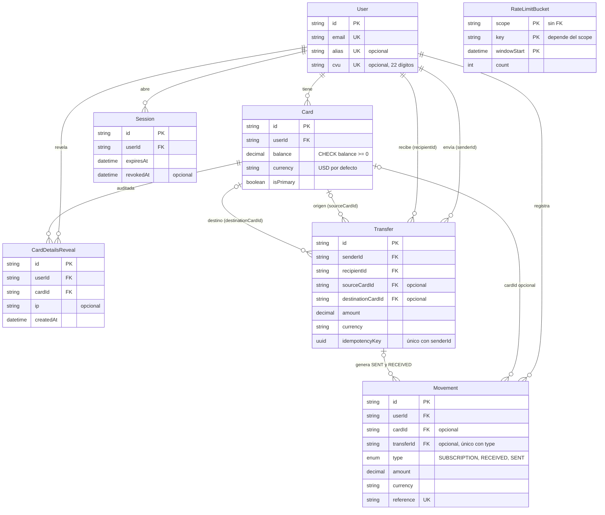
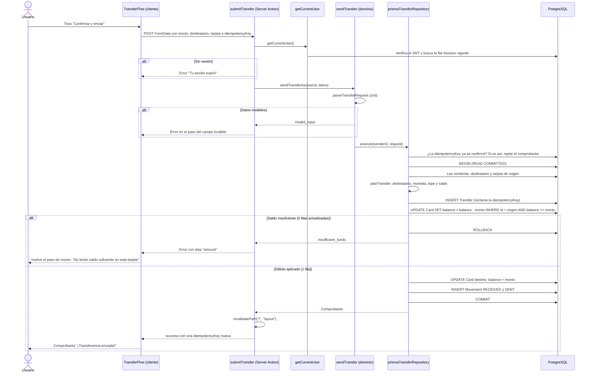

<p align="center">
  
</p>

<h1 align="center">GranaBank</h1>

<p align="center">
  <strong>La billetera del Club Atlético Lanús.</strong><br>
  Challenge técnico para el Club Atlético Lanús: home banking mobile-first construido a partir del diseño de Figma.<br>
  <em>"Con cada compra, sumás orgullo granate"</em>
</p>

<p align="center">
  
  
  
  
  
</p>

<p align="center">
  <a href="https://github.com/techfixdev/challenge-tecnico-clublanus"><strong>Repositorio</strong></a> ·
  <a href="#video">Video</a> ·
  <a href="#demo">Demo</a> ·
  <a href="#flujo-de-la-app">Flujo</a> ·
  <a href="#cómo-correrlo">Cómo correrlo</a> ·
  <a href="#requerimientos-del-challenge">Requerimientos</a> ·
  <a href="#decisiones-técnicas">Decisiones técnicas</a> ·
  <a href="#qué-mejoraría-con-más-tiempo">Qué mejoraría</a>
</p>

Login, dos tarjetas (dólares y pesos) con sus datos ocultos por defecto, movimientos con búsqueda, filtros, agrupación por día y resumen del mes, detalle de cada movimiento, transferencias reales entre usuarios demo en tres pasos y una pantalla de Recibir con alias, CVU y QR. Todo con la paleta y el escudo oficiales del club.

| Login                                | Inicio                               | Movimientos                                    | Detalle                                          |
| ------------------------------------ | ------------------------------------ | ---------------------------------------------- | ------------------------------------------------ |
|  |  |  |  |

| Transferir: destinatario                                             | Transferir: monto                                          | Transferir: revisión                                          | Recibir                                  |
| -------------------------------------------------------------------- | ---------------------------------------------------------- | ------------------------------------------------------------- | ---------------------------------------- |
|  |  |  |  |

Capturas del build de producción a 390×844 (@2x).

## Video

<p align="center">
  <a href="docs/videos/recorrido.mp4"></a>
</p>

- [**Recorrido con subtítulos**](docs/videos/recorrido.mp4) (≈2 min): la app real de punta a punta, con una tarjeta por pantalla que dice qué venía del diseño original y qué es nuevo.
- [**Antes y después**](docs/videos/antes-y-despues.mp4) (≈45 s): Login, Inicio y Movimientos del Figma al lado de la app, y al final las pantallas agregadas (detalle, transferir y recibir).

## Demo

- **Repositorio:** [github.com/techfixdev/challenge-tecnico-clublanus](https://github.com/techfixdev/challenge-tecnico-clublanus)
- **Deploy:** [challenge-tecnico-clublanus.vercel.app](https://challenge-tecnico-clublanus.vercel.app) (Vercel + Neon Postgres)
- **Credenciales de prueba:** `soygranate@clublanus.com` / `GRANATE1@`

## Requerimientos del challenge

Cada requerimiento de la consigna, con dónde se cumple. El detalle con su evidencia está en [`docs/CHECKLIST.md`](docs/CHECKLIST.md).

| Requerimiento                                     | Estado   | Dónde                                                                                                                                                                              |
| ------------------------------------------------- | -------- | ---------------------------------------------------------------------------------------------------------------------------------------------------------------------------------- |
| Lista de elementos                                | Cumplido | Movimientos ([`/movimientos`](<src/app/(app)/movimientos/(list)/page.tsx>)) y "Últimos movimientos" en Inicio                                                                      |
| Detalle de un elemento                            | Cumplido | [`/movimientos/[id]`](<src/app/(app)/movimientos/[id]/page.tsx>), con 404 real                                                                                                     |
| Estados de carga, error y vacío                   | Cumplido | `loading.tsx` y `error.tsx` por pantalla, [`MovementsEmptyState`](src/features/movements/ui/MovementsEmptyState.tsx) (ver [Cómo ver los estados](#cómo-ver-los-estados))           |
| App funcional y navegable                         | Cumplido | Login → Inicio → Movimientos → detalle → Transferir / Recibir → cerrar sesión, cubierto por los e2e                                                                                |
| Next.js + TypeScript                              | Cumplido | Next.js 16 (App Router) y TypeScript estricto                                                                                                                                      |
| Backend con API routes de Next                    | Cumplido | [`src/app/api`](src/app/api) (ver [API](#api))                                                                                                                                     |
| Base relacional (PostgreSQL) + ORM                | Cumplido | PostgreSQL 17 + Prisma 7 ([`prisma/schema.prisma`](prisma/schema.prisma), migraciones y seed)                                                                                      |
| Validaciones, estructura, estados y datos, UX     | Cumplido | zod en el servidor, features por capas, filtros en la URL y paginación por cursor, feedback y accesibilidad                                                                        |
| Diseño de Figma (Login, Inicio, Movimientos)      | Cumplido | Layout y textos del Figma ([`docs/design/`](docs/design)); desvíos deliberados y documentados en [Marca](#marca-club-atlético-lanús) y [Decisiones técnicas](#decisiones-técnicas) |
| Repositorio en GitHub                             | Cumplido | [techfixdev/challenge-tecnico-clublanus](https://github.com/techfixdev/challenge-tecnico-clublanus)                                                                                |
| Deploy en Vercel                                  | Cumplido | [challenge-tecnico-clublanus.vercel.app](https://challenge-tecnico-clublanus.vercel.app), con PostgreSQL en Neon                                                                   |
| README: cómo correrlo, decisiones y qué mejoraría | Cumplido | [Cómo correrlo](#cómo-correrlo), [Decisiones técnicas](#decisiones-técnicas), [Qué mejoraría](#qué-mejoraría-con-más-tiempo)                                                       |

## Flujo de la app

Recorrido entre pantallas según las rutas reales y la protección de `proxy.ts`; las flechas punteadas son caminos de error.



## Stack

- **Next.js 16** (App Router, Server Components, Server Actions) + **TypeScript** estricto
- **PostgreSQL 17** + **Prisma 7** (driver adapter `@prisma/adapter-pg`)
- **Tailwind CSS v4**, tipografía Poppins (UI) y Rokkitt (logotipo "GranaBank", títulos de pantalla y montos grandes; ver [Marca](#marca-club-atlético-lanús))
- **Motion** (motion.dev, sucesor de Framer Motion) para resortes, valores ligados al scroll y animaciones de layout
- **zod** (validación en el servidor; `zod/mini` para la respuesta de "Cargar más"), **jose** (JWT), **bcryptjs**
- **Vitest** + Testing Library, **Playwright**, GitHub Actions

## Cómo correrlo

Requisitos: **Node 22+**, **pnpm**, **Docker**.

```bash
git clone https://github.com/techfixdev/challenge-tecnico-clublanus.git
cd challenge-tecnico-clublanus
pnpm install              # también genera el cliente de Prisma
cp .env.example .env      # en producción, generar SESSION_SECRET con: openssl rand -base64 32
pnpm db:up                # PostgreSQL en Docker (puerto 5432)
pnpm db:migrate           # aplica las migraciones
pnpm db:seed              # 2 usuarios demo, 5 destinatarios ficticios, tarjetas, movimientos y 6 transferencias pasadas (idempotente)
pnpm dev                  # http://localhost:3000
```

Puertos: app `3000`, PostgreSQL `5432`, servidor de los tests e2e `3100`.

**Probarlo desde el celular (misma Wi‑Fi):** Next bloquea en dev los assets pedidos desde otro host, así que hay que habilitar la IP de la máquina con `ALLOWED_DEV_ORIGINS` (lista separada por comas; solo aplica a `next dev`):

```bash
ALLOWED_DEV_ORIGINS=192.168.1.10 pnpm dev -H 0.0.0.0   # luego abrir http://192.168.1.10:3000
```

Si hay firewall, abrir el puerto 3000 solo para la red local. Con `next start` a secas no sirve por `http://`: en producción la cookie de sesión es `Secure` y el navegador la descarta fuera de HTTPS (salvo en `localhost`). Para eso está el preview de abajo.

**Probar el build de producción en el celular:** el modo dev no muestra la velocidad real. `pnpm preview:lan` hace el build y lo sirve en `0.0.0.0:3001` con `GRANABANK_LAN_PREVIEW=1`, que deja la cookie de sesión **sin `Secure`** solo para esta prueba local. Usa la base de `DATABASE_URL` (`.env`, la de desarrollo), así se ven los mismos datos que en `pnpm dev`. Puede correr junto a `pnpm dev` en el 3000 (dev usa `.next/dev` y el build no lo toca).

```bash
sudo ufw allow from 192.168.100.0/24 to any port 3001 proto tcp   # una vez, si hay ufw
pnpm preview:lan                                                  # luego abrir http://<IP-de-la-máquina>:3001
```

Barandas: la variable solo se acepta con el valor `1`; con `VERCEL`/`VERCEL_ENV` presentes el build y el arranque fallan (nunca puede llegar a un deploy) y fuera de producción se ignora; al activarse imprime un aviso. Correr `pnpm build` (por ejemplo, para los e2e) mientras el preview está levantado reemplaza su build: conviene reiniciarlo.

### Variables de entorno

| Variable                | Obligatoria | Para qué                                                                                                  |
| ----------------------- | ----------- | --------------------------------------------------------------------------------------------------------- |
| `DATABASE_URL`          | Sí          | PostgreSQL de la app                                                                                      |
| `SESSION_SECRET`        | Sí          | Firma de la sesión (JWT); al menos 32 caracteres (`openssl rand -base64 32`)                              |
| `DEMO_CVV_SECRET`       | No          | Secreto para derivar el CVV de demo de cada tarjeta; si no está, se usa `SESSION_SECRET`                  |
| `TEST_DATABASE_URL`     | No          | Base de los tests de integración y e2e; por defecto, `DATABASE_URL` con `_test` (ver [Testing](#testing)) |
| `ALLOWED_DEV_ORIGINS`   | No          | Hosts extra (separados por coma) que pueden cargar los assets de `next dev`, p. ej. la IP de la LAN       |
| `GRANABANK_LAN_PREVIEW` | No          | `1` solo para el preview local del build en el celular (`pnpm preview:lan`); nunca en un deploy           |

## Tour del código

Un recorrido corto para leerlo sin perderse. Cada feature tiene la misma forma: `domain/` (reglas puras, sin Prisma ni React), `data/` (Prisma), `server/` (solo servidor) y `ui/` (componentes).

**Por dónde empezar**

| Tema                         | Dónde leer                                                                                                                                                                                                                                                                                                               |
| ---------------------------- | ------------------------------------------------------------------------------------------------------------------------------------------------------------------------------------------------------------------------------------------------------------------------------------------------------------------------ |
| Rutas de entrada             | [Home](<src/app/(app)/(home)/page.tsx>), [Movimientos](<src/app/(app)/movimientos/(list)/page.tsx>), [Transferir](<src/app/(app)/transferir/page.tsx>), [login](src/app/login), [API REST](src/app/api) y [`proxy.ts`](src/proxy.ts) (protección de rutas)                                                               |
| Transferencia (caso de uso)  | [`transfer.ts`](src/features/transfers/domain/transfer.ts) (`planTransfer`, `sendTransfer`) → [`prisma-transfer-repository.ts`](src/features/transfers/data/prisma-transfer-repository.ts): una transacción con débito condicional (sin sobregiro) e idempotencia por `(remitente, clave)`                               |
| Movimientos (keyset)         | [`movement-cursor.ts`](src/features/movements/domain/movement-cursor.ts) (cursor `fecha + id`) y [`prisma-movement-repository.ts`](src/features/movements/data/prisma-movement-repository.ts) (`(fecha, id) < cursor`, sin `OFFSET`)                                                                                     |
| Autenticación y sesión       | [`sign-in.ts`](src/features/auth/server/sign-in.ts) → [`session-token.ts`](src/features/auth/server/session-token.ts) (JWT HS256 en cookie `httpOnly`) → [`session.ts`](src/features/auth/server/session.ts) (sesión en base, revocable) → [`current-user.ts`](src/features/auth/server/current-user.ts) (`requireUser`) |
| Sistema de movimiento        | [`shared/ui/motion/`](src/shared/ui/motion): duraciones y curvas ([`tokens.ts`](src/shared/ui/motion/tokens.ts)), resortes ([`springs.ts`](src/shared/ui/motion/springs.ts)) y transiciones de navegación ([`navigation.ts`](src/shared/ui/motion/navigation.ts))                                                        |
| Gestos (física del arrastre) | [`drag-physics.ts`](src/shared/ui/gestures/drag-physics.ts): seguimiento 1:1, banda elástica, velocidad al soltar, proyección y asentamiento, compartida por el carrusel de Transferir, las tarjetas y el deslizar para volver                                                                                           |
| Tokens de diseño             | [`globals.css`](src/app/globals.css) (colores, sombras y movimiento por secciones) → `pnpm tokens:figma` → [`design/tokens.figma.json`](design/tokens.figma.json)                                                                                                                                                        |

**Mapa de carpetas**

| Carpeta                                  | Qué hay                                                                       |
| ---------------------------------------- | ----------------------------------------------------------------------------- |
| `src/app/`                               | Rutas delgadas: páginas, `loading`/`error`, API REST. Solo conectan features. |
| `src/features/<x>/{domain,data,ui}`      | `auth`, `account`, `movements`, `transfers` (más `server/` donde hace falta)  |
| `src/shared/`                            | `lib/` (dinero, fechas, errores de API, db), `ui/` (botones, barras, motion)  |
| `prisma/`, `e2e/`, `scripts/`, `design/` | Esquema y seed, Playwright, herramientas (base de tests, Figma), tokens       |

**Tests:** al lado del código (`x.ts` + `x.test.ts`). Unitarios con `pnpm test` (1065 en 114 archivos, sin base), integración `*.integration.test.ts` con `pnpm test:integration` (72 en 10 archivos, PostgreSQL real) y e2e en `e2e/` con `pnpm test:e2e` (116 en 16 archivos, Chromium móvil, en dos proyectos: solo lectura y con escrituras). Detalle en [Testing](#testing).

## Scripts

| Script                               | Qué hace                                                    |
| ------------------------------------ | ----------------------------------------------------------- |
| `pnpm dev` / `build` / `start`       | Servidor de desarrollo, build de producción y servidor      |
| `pnpm preview:lan`                   | Build + `next start` en `0.0.0.0:3001` para el celular      |
| `pnpm lint` / `typecheck` / `format` | ESLint, `tsc --noEmit` (con tipos de rutas), Prettier       |
| `pnpm format:check`                  | Verifica el formato sin modificar archivos                  |
| `pnpm test` / `test:watch`           | Tests unitarios y de componentes (sin base de datos)        |
| `pnpm test:integration`              | Tests de integración contra PostgreSQL                      |
| `pnpm test:e2e`                      | Tests end-to-end con Playwright                             |
| `pnpm db:up`                         | Levanta PostgreSQL con Docker Compose                       |
| `pnpm db:migrate` / `db:deploy`      | `prisma migrate dev` / `prisma migrate deploy`              |
| `pnpm db:seed` / `db:reset`          | Carga los datos demo / resetea la base y vuelve a cargar    |
| `pnpm db:test [comando]`             | Prepara la base de tests y, opcional, corre un comando ahí  |
| `pnpm tokens:figma [--check]`        | Exporta los tokens a Figma (`--check`: falla si está viejo) |
| `pnpm screens:capture`               | Captura cada pantalla y estado en PNG para Figma            |

## Estructura del proyecto

Organizada por funcionalidad ("screaming architecture"): las carpetas dicen qué hace la app, no qué framework usa.

```
src/
├── app/                 rutas delgadas: conectan features (páginas, error boundaries, API REST)
├── features/
│   ├── auth/            domain/ data/ server/ ui/
│   ├── movements/       domain/ data/ ui/
│   ├── account/         domain/ data/ server/ ui/
│   └── transfers/       domain/ data/ server/ ui/
├── shared/              lib/ (db, errores de API, fechas, formato, dinero exacto) · ui/ (Button, BottomNav…)
├── proxy.ts             protección optimista de rutas
└── test/                fixtures y repositorio en memoria
prisma/                  schema, migraciones y seed
e2e/                     Playwright
```

Cada feature usa las mismas capas, y solo las que necesita:

| Capa      | Contenido                                                                      |
| --------- | ------------------------------------------------------------------------------ |
| `domain/` | Reglas puras, casos de uso, schemas zod y tipos. No conoce Prisma ni React.    |
| `data/`   | Repositorios con Prisma que implementan los puertos del dominio.               |
| `server/` | Puntos de entrada solo de servidor: Server Actions, login, sesión.             |
| `ui/`     | Componentes. Server Components por defecto; Client solo donde hay interacción. |

Los tests viven al lado del código (`x.ts` + `x.test.ts`). Las dependencias van en una sola dirección: `ui` y `data` dependen de `domain`, nunca al revés.

## Arquitectura

Tres vistas del mismo sistema, sacadas del código: cómo dependen las capas, qué guarda la base y qué pasa cuando se envía una transferencia.

### Capas y dependencias

Las flechas son imports reales. `domain/` solo usa zod y utilidades puras de `shared/lib`; Prisma entra únicamente por `data/` y `shared/lib/db.ts`. Las páginas pasan las Server Actions a la UI como props, y las listas de movimientos (Server Components) leen el repositorio directamente.



### Modelo de datos

Campos clave de [`prisma/schema.prisma`](prisma/schema.prisma). Los montos son `Decimal(12,2)`. `RateLimitBucket` no tiene FK: se identifica por `(scope, key, windowStart)`.



### Secuencia de una transferencia

Del botón "Confirmar y enviar" al comprobante. La UI usa la Server Action `submitTransfer`; `POST /api/transfers` comparte el mismo `sendTransferAs`. Lo que impide el sobregiro bajo concurrencia es el débito condicional, no la lectura previa del saldo.



El débito y el crédito se ejecutan en orden de id de tarjeta para que dos transferencias cruzadas no se bloqueen entre sí. Si `planTransfer` rechaza antes de mover dinero (destinatario inexistente, moneda distinta, tope), la transacción también hace rollback y la UI vuelve al paso que corresponde: destinatario o monto.

## Decisiones técnicas

- **App Router + Server Components.** Las páginas leen la base en el servidor: no hay credenciales ni consultas en el navegador y se envía menos JavaScript. Client Components solo donde hay interacción: formularios, búsqueda, "Cargar más", el flujo de Transferir, los gestos y el saldo (odómetro y ocultar).
- **API routes en lugar de un backend separado.** La consigna lo permite: un proyecto, un deploy, tipos compartidos. Las rutas REST reutilizan los mismos casos de uso que las páginas.
- **Prisma + PostgreSQL.** Tipos generados desde el schema y migraciones versionadas. Para la búsqueda se usa SQL parametrizado (`Prisma.sql`), probado contra una base real.
- **Montos `Decimal(12,2)`**, que viajan como string (`"125.00"`): un `float` acumula errores de redondeo.
- **Dos monedas, sin conversión.** La Mastercard opera en dólares (`USD`) y la Visa en pesos (`ARS`); cada movimiento está en la moneda de su tarjeta. Nunca se convierte ni se suman pesos con dólares.
- **Formato argentino para las dos monedas** (desvío deliberado del Figma, que muestra "978.85"): `$ 312.400,50` (pesos) y `US$ 978,85` (dólares), con punto de miles y coma decimal, como los muestran los bancos argentinos. Con pesos y dólares en la misma pantalla, un solo formato y símbolos distintos evitan leer el `$` de los pesos como dólares. Los montos redondos siguen sin ",00" (`US$ 125`), como en la lista del diseño. Todo pasa por **un solo formateador** (`formatMoney(monto, moneda)` en `src/shared/lib/format.ts`), que arma el texto desde centavos exactos (no `Intl` sobre un `float`), así servidor y navegador escriben lo mismo. Los lectores de pantalla escuchan la moneda en palabras ("978,85 dólares", "más 95 dólares"). El chip de cada tarjeta muestra su moneda (`USD` / `ARS`).
- **QR de Recibir: texto plano, no un QR de pago.** Codifica `GranaBank` + `Alias: …` + `CVU: …` (22 dígitos sin espacios), en líneas, para que cualquier cámara lo muestre y se pueda copiar a otra app. **No** es un QR interoperable de "Transferencias 3.0": ese es un payload EMVCo que emite un adquirente registrado ante el BCRA, y una demo no debe imitarlo. Se dibuja en el servidor como SVG en línea (sin JavaScript en el navegador ni imagen aparte), con módulos granate sobre blanco, zona de silencio de 4 módulos y corrección de errores H, sin logo en el centro para que todo ese margen quede para escanear. Librería: [`uqr`](https://github.com/unjs/uqr) (MIT, sin dependencias, ~79 KB sin comprimir en `node_modules`, solo corre en el servidor); se descartó `qrcode` porque arrastra `pngjs`, `yargs` y `dijkstrajs` para funciones (PNG, CLI) que no se usan.
- **Sesión: JWT en cookie `httpOnly`**, `sameSite=lax` y `secure` en producción.
- **Sesiones revocables.** Cada inicio de sesión crea una fila en `Session` (id opaco de 256 bits al azar, usuario, vencimiento, `revokedAt`) y el JWT firmado lleva ese id (`jti`) y el del usuario. Cerrar sesión **revoca la fila en el servidor** antes de borrar la cookie: una copia del token deja de servir en el acto, aunque su firma y su vencimiento sigan siendo válidos. Si la base no responde al revocar, la cookie se borra igual y la falla queda en el log: se prioriza que el usuario siempre pueda salir en ese dispositivo, a cambio de que esa sesión siga viva en el servidor hasta su vencimiento.
  - **Proxy rápido, servidor con la autoridad** (lo que recomienda la guía de autenticación de Next): `proxy.ts` corre en cada pedido, incluidas las precargas, así que solo verifica la firma y el vencimiento del token, sin tocar la base, y rechaza al instante un token falsificado. La decisión real la toma el servidor: `getCurrentUser()`/`requireUser()`, que usan las páginas, las Server Actions y las rutas de la API, exigen una sesión viva (no revocada, no vencida, del mismo usuario que dice el token) en **una sola consulta** que trae también al usuario, memorizada por pedido con `cache()` de React. Una sesión revocada lleva a `/login?expired=1`. Ahí el proxy borra solo una cookie que no puede verificar; una firmada correctamente la manda a `GET /api/auth/expired-session`, donde el servidor (que ve la fila de la sesión) la borra **solo si la sesión está muerta** y lleva a `/login`, o vuelve a Home sin tocarla si sigue viva. Así un link de otro sitio a `/login?expired=1` no puede cerrar una sesión viva, y una revocada termina en el login sin bucle de redirecciones (los dos casos tienen test unitario y e2e).
  - **Cerrar sesión en todos los dispositivos:** existe en el servidor (`revokeAllSessionsForUser(userId)` en `src/features/auth/server/session.ts`, sobre `revokeSessionsByUserId` del repositorio, con test de integración). Por decisión de producto **no tiene pantalla ni ruta**: la app no suma interfaz nueva; queda lista para conectarla a un botón o a un flujo de "cambié mi contraseña".
  - **Limpieza sin cron:** al iniciar sesión se borran las filas revocadas o vencidas de ese usuario, así la tabla queda acotada a las sesiones vivas.
  - "Recordarme" no cambia: 30 días con la casilla, 1 día (y cookie de sesión del navegador) sin ella. El seed recrea tarjetas y movimientos pero no los usuarios, así que no cierra sesiones; si se borra un usuario, sus sesiones se borran con él (`ON DELETE CASCADE`).
- **Un schema zod por formulario/parámetro en el servidor** (la validación real). El feedback inmediato del navegador corre las mismas reglas como funciones puras (`*-rules.ts`), sin zod: el schema delega en ellas o las comparte, y un test compara ambos veredictos caso por caso. Así zod (~89 KB gzip) no viaja al navegador; "Cargar más" valida la respuesta con `zod/mini` (~16 KB), incluido en la página de movimientos: cargarlo bajo demanda ahorraba poco y agregaba dos fallas (una descarga colgada o un archivo borrado por un deploy dejaban el botón sin funcionar).
- **Precarga completa de las pantallas probables** (`prefetch` en Enviar/Recibir, "Ver todos" y Movimientos de la barra): abren listas, sin pasar por su esqueleto. Cuesta un render en el servidor por destino cada vez que se precarga (la caché del router se limitó a 30 s con `staleTimes.static`, porque por defecto son 5 min y un ingreso enviado por otra persona tardaría eso en aparecer; una transferencia propia la invalida al instante).
- **Filtros en la URL** (`?q=&type=`): se pueden compartir, sobreviven al recargar y funcionan con el botón atrás; el filtrado ocurre en la base. Búsqueda con debounce de 300 ms y `router.replace`.
- **Búsqueda que no pierde lo escrito.** Los dos buscadores (Movimientos y destinatario de Transferir) escuchan el evento `input` nativo del campo, además de `onChange`, y al montar adoptan el texto que difiera del valor del servidor. Así funcionan aunque se pegue un texto justo mientras arranca una transición de vista (React no recibe ese evento) o se escriba antes de que la página hidrate. Cada caso tiene un test unitario y un e2e (`e2e/search-paste.spec.ts`).
- **Montos con signo por dirección** (desvío del Figma, que los muestra sin signo): lo que sale lleva `−` (U+2212, el signo menos tipográfico) y lo que entra `+`: `−US$ 125`, `+US$ 95`. Entra solo lo **recibido**; salen lo **enviado** y los **débitos automáticos**. El color del monto también sigue la dirección y no el tipo: granate (`received`) para lo que entra, tinta (`foreground`) para lo que sale; el color de cada tipo queda en su ícono. Los lectores de pantalla escuchan "más 95 dólares" / "menos 125 dólares" y el tipo ("Recibido", "Débito automático"). El detalle usa la misma convención.
- **Lista agrupada:** las filas comparten una sola superficie blanca con separadores finos que arrancan después del ícono (lista agrupada de iOS / Monzo), en lugar de una tarjeta con sombra por fila: entran más filas en pantalla y se leen como una lista. En Movimientos se agrupan **por día** con encabezados que quedan pegados debajo del buscador y los chips ("Hoy", "Ayer", "5 de octubre"; el año solo si no es el actual), con el día calendario de Buenos Aires. El servidor decide "hoy" una vez y lo pasa a la lista, así servidor y navegador nombran igual los días. "Cargar más" suma la página siguiente al mismo grupo si continúa un día. En Home los cinco últimos van en un solo grupo, sin encabezados: partidos en dos o tres días se leerían como fragmentos.
- **Paginación por cursor** (`occurredAt` + `id`): estable aunque entren movimientos nuevos y aprovecha el índice `(userId, occurredAt)`.
- **Protección IDOR.** Toda consulta filtra por el `userId` de la sesión; un id ajeno responde el mismo 404 que uno inexistente.
- **Búsqueda sin acentos** con la extensión `unaccent` ("jose" encuentra "José"), escapando `%` y `_`.
- **Índice trigram para la búsqueda.** `ILIKE '%texto%'` no puede usar un índice B-tree (el término no es un prefijo), así que contraparte y descripción tienen índices GIN `gin_trgm_ops` (extensión `pg_trgm`). Postgres solo usa un índice de expresión si la consulta repite la misma expresión, y `unaccent()` no es `IMMUTABLE`: por eso una función `immutable_unaccent` (que fija el diccionario) se usa igual en el índice y en la consulta. El resultado de la búsqueda no cambia; con volumen, el plan pasa de recorrer las filas del usuario a un `BitmapOr` sobre los dos índices. Términos de menos de 3 letras no aprovechan el índice. Ambas extensiones están disponibles en Neon.
- **Acciones del detalle:** debajo del comprobante, una lista agrupada con "Compartir comprobante" (la hoja nativa de compartir con el comprobante en texto, sin datos de la tarjeta; donde no existe, como en la URL de la LAN por http, lo copia y avisa "Copiado"), "Copiar referencia" y, solo en una transferencia **enviada** a una cuenta con alias, "Repetir transferencia". El estado se muestra una sola vez, en la etiqueta debajo del monto.
- **Repetir transferencia (`/transferir?to=alias`):** el parámetro es entrada del usuario como cualquier otra. El servidor lo valida con las mismas reglas del formulario (solo alias: un CVU nunca viaja en una URL) y lo resuelve igual que la búsqueda del paso 1 (cuenta existente, no la propia). Si se confirma, el flujo abre en el paso del monto; si no, el alias queda escrito en el paso 1 y "Continuar" explica por qué no se puede usar. Nunca se confía en lo que dice el link.
- **404 real en el detalle.** El detalle no tiene `loading.tsx`, así el status no queda fijo en 200 antes de saber si el movimiento existe.
- **Zona horaria de Buenos Aires** para mostrar fechas: Vercel corre en UTC y un pago de las 22 h aparecería al día siguiente.
- **Datos de la tarjeta bajo demanda (ocultos por defecto).** Cada tarjeta tiene su propio ojo y controla solo esa tarjeta. Oculta, muestra el saldo como `••••••`, el número como `•••• •••• •••• 1234` y el CVV como `•••`; al revelarla, el saldo rueda en el odómetro, aparece el número completo (4-4-4-4) y, en el reverso, el CVV.
  - **Nada sensible en la página inicial:** Home renderiza las tarjetas desde su "cara" (`CardFace`, sin saldo); ni el HTML ni el payload RSC traen saldo, número completo o CVV (un e2e lo verifica sobre el HTML). Recién al tocar el ojo el cliente pide `POST /api/account/cards/:id/details` (POST y no GET porque un revelado tiene efectos: gasta cupo y escribe auditoría, así que un link, una imagen o una precarga no pueden dispararlo; GET responde 405 y otro `Origin`, 403), que reverifica la sesión, busca la tarjeta **por dueño** (una ajena responde 404, igual que una inexistente) y responde con `Cache-Control: no-store`. Una request por revelado, sin polling ni reintentos automáticos, limitada a 10 por usuario cada 10 minutos y registrada en un log de auditoría (ver "Límites de intentos").
  - **Se vuelven a ocultar solos** a los 30 segundos, al ocultarse la pestaña (`visibilitychange`) o al salir de la página; ocultar también borra los datos de la memoria del componente.
  - **Decisión: la preferencia ya no se recuerda.** Antes el ojo era uno solo (en la principal) y su elección vivía en una cookie. Ahora todo arranca oculto en cada visita, como pidió el usuario: recordar "visible" obligaría a mandar el saldo en el HTML inicial, justo lo que se quería evitar. El costo es una request (~decenas de ms) antes de que ruede el saldo.
  - **Números ficticios:** cada tarjeta demo guarda un PAN de 16 dígitos inventado, válido por Luhn y consistente con sus últimos 4 (`buildDemoPan`, determinístico por usuario: el seed es idempotente). Un `CHECK` en la base exige 16 dígitos que terminen en `last4`. Cómo se guardaría con tarjetas reales: ver [El número de tarjeta en producción](#el-número-de-tarjeta-en-producción).
  - **El CVV no se guarda:** PCI DSS prohíbe almacenarlo después de autorizar (v4.0, requisito 3.3.1). Para la demo se **deriva** en el servidor, solo para mostrarlo: HMAC-SHA256 del id de la tarjeta con un secreto del servidor (`DEMO_CVV_SECRET`, o `SESSION_SECRET` si no está), reducido a 3 dígitos. Es estable por tarjeta y no está en la base.
- **Vuelta de tarjeta:** tocar la tarjeta la da vuelta (ver "Movimiento y accesibilidad"); el reverso tiene banda magnética, panel de firma con el titular, CVV y la marca.
- **Resumen del mes en Movimientos:** "Octubre · Ingresos +US$ X · Egresos −US$ Y", **una línea por moneda** (dólares primero, la de la tarjeta principal; después pesos): nunca suma monedas distintas. Ingresos = recibidos; egresos = enviados + débitos automáticos; solo movimientos **completados** (un pendiente todavía puede fallar). Mes calendario de Buenos Aires (empieza a las 03:00 UTC). No depende de la búsqueda ni del filtro: describe el mes. La base suma los `Decimal` (`groupBy`) y la app solo los combina como centavos enteros, nunca como `float`.
- **Transferencias entre usuarios** (`src/features/transfers`): por alias o CVU (el CVU se valida con sus dígitos verificadores, como un CBU). Todo ocurre en **una sola transacción**: se reclama la clave de idempotencia, se debita, se acredita en la tarjeta del destinatario **en la misma moneda** que la de origen (la principal si hay varias; sin conversión) y se crean los dos movimientos (`SENT` y `RECEIVED`, enlazados a un `Transfer`); si algo falla, no queda nada a medias.
  - **Tres pasos en una sola superficie:** destinatario (buscador "Buscar por nombre, alias o CVU" y carrusel de Recientes), monto (teclado numérico propio y elección de la tarjeta de origen) y revisión ("Confirmar y enviar"), seguidos del comprobante. El débito es condicional: si el saldo no alcanza, la transferencia se rechaza (`INSUFFICIENT_FUNDS`) y no hay sobregiro.
  - **Buscador de destinatario:** el primer paso tiene un solo campo, "Buscar por nombre, alias o CVU". Mientras se escribe filtra el carrusel de Recientes en el navegador (sin mayúsculas ni tildes que importen; un CVU por sus últimos dígitos visibles, con o sin espacios) y elige la primera coincidencia; si no queda ninguna, lo dice ("Sin coincidencias en tus recientes"). Si lo escrito es un alias o CVU válido que no es de un reciente, ofrece "Buscar «…»", que lo resuelve en el servidor como "Continuar" (también junto a coincidencias parciales: el alias `hincha` sigue siendo alcanzable aunque exista `hincha.granate`). Arrastrar el carrusel elige sin reescribir la búsqueda. `?to=<alias>` escribe el alias en el campo.
  - **Sin sobregiro con concurrencia:** el débito es un `UPDATE` condicional (`WHERE balance >= monto`). PostgreSQL bloquea la fila y reevalúa la condición con el saldo ya confirmado, así que de N transferencias simultáneas solo pasan las que alcanzan. Se eligió esto en lugar de `SERIALIZABLE`, que obligaría a reintentar ante cada conflicto sin dar más garantías para una invariante de una sola fila. Un `CHECK (balance >= 0)` en la base es la red de seguridad. Las dos tarjetas se actualizan siempre en el mismo orden (por id) para que A→B y B→A simultáneas no se bloqueen entre sí.
  - **Idempotencia:** el cliente manda un UUID por intento (`idempotencyKey`, único por emisor). Un reintento o doble toque con la misma clave devuelve la transferencia original (200, `replayed: true`) sin mover plata dos veces, incluso si las dos requests llegan a la vez; la misma clave con otros datos responde 409.
  - **Referencia legible:** cada transferencia recibe un código corto al azar en base32 de Crockford (`7Q4K-92XA`: 40 bits, sin `I`, `L` ni `O`, que se confunden con `1` y `0`, y sin `U`, para no formar palabras ofensivas por accidente). Los dos movimientos lo comparten con el lado como prefijo (`ENV-7Q4K-92XA` para quien envía, `REC-7Q4K-92XA` para quien recibe): cada referencia sigue siendo única en la base (índice único) y las dos personas citan el mismo código. Si un código ya existe, la transacción se repite con otro.
  - **Moneda:** pesos desde la Visa llegan a una tarjeta en pesos del destinatario (el seed le da una a `hincha`); si no tiene ninguna en esa moneda, se rechaza con `CURRENCY_MISMATCH` ("La cuenta de destino no opera en la moneda de esta tarjeta") y el usuario vuelve al paso del monto para elegir otra tarjeta.
  - **Monto:** el campo muestra el símbolo de la tarjeta elegida y acepta el formato argentino. Reglas de lo que escribe una persona (`parseAmount` en `src/shared/lib/money.ts`): una sola coma es el separador decimal (`12,30`, `1.234,56`); sin coma, los puntos seguidos de 3 dígitos agrupan miles (`1.234` = 1234) y un punto seguido de 1 o 2 dígitos es el decimal (`12.30`); lo ambiguo se rechaza (`1,234`, `1.2345`, `0.123`). Hasta 2 decimales y 10 dígitos enteros.
  - **Al tipear:** el campo agrupa los miles mientras se escribe (`12.500,5`) sin que salte el cursor, sin abrir el teclado del sistema (`inputMode="none"`): el teclado numérico propio del paso escribe en el campo, y un teclado físico o un pegado también funcionan. Solo cambia cómo se ve: lo que muestra se lee con las mismas reglas de arriba y da el mismo monto (`editAmount` en `src/features/transfers/domain/amount-editing.ts`). Un punto tipeado después de los dígitos queda abierto hasta que los dígitos siguientes deciden (2 → decimal, 3 → miles); después de miles, es la coma decimal.
  - **Tarea enfocada:** dentro de `/transferir` (pasos y comprobante) no hay barra inferior, y el botón principal de cada paso queda fijo abajo, siempre visible, con el margen del área segura y por encima del teclado (`visualViewport`). Deshabilitado se ve gris plano, no granate desvaído. La transferencia sale por defecto de la cuenta en **pesos** (la de todos los días), aunque la principal de Home sea la de dólares.
  - **Frontera humano / máquina:** esas reglas viven solo del lado del formulario. El formulario (y la Server Action, por ser un endpoint público) convierte lo escrito al **monto canónico** (`1.234,56` → `"1234.56"`) antes de llegar al dominio; el dominio, el schema del servidor y la API REST solo aceptan montos canónicos (`parseCanonicalAmount`), donde un punto es siempre el decimal. Así un cliente de la API que manda `"12.500"` queriendo decir 12,5 recibe un 400, en vez de mover 12.500. Los límites y los mensajes son los mismos en los dos lados (`checkAmountLimits` en `transfer-rules.ts`).
  - **Tope por transferencia, por moneda:** US$ 100.000 y $ 100.000.000 (del mismo orden una vez convertidos). El servidor valida el tope más alto antes de leer la tarjeta y el de su moneda dentro de la transacción (`AMOUNT_OVER_LIMIT`); el formulario ya conoce la tarjeta y avisa al tipear.
  - Los rechazos de negocio (saldo insuficiente, destinatario inexistente, a uno mismo, otra moneda, tope) son valores de una unión discriminada, no excepciones, y responden 404/422 con mensaje en español.
- **Límites de intentos en PostgreSQL (sin Redis).** En serverless cada instancia tiene su propia memoria, así que un contador en memoria no limita nada; la base es lo único que todas comparten, y así no se suma otro servicio (funciona igual en Vercel + Neon).
  - **Login:** cada 15 minutos, 5 intentos fallidos por **email + IP**, 50 por email (sumando todas las IP) y 20 por IP. El límite ajustado va por email e IP juntos para que **un tercero que conoce el email no pueda bloquear la cuenta**: quien agota esos 5 intentos se bloquea a sí mismo, y el dueño sigue entrando desde su red. El tope de 50 por email frena igual a quien reparte los intentos entre muchas IP (llegar a él sí bloquea la cuenta hasta que termine la ventana, pero cuesta diez veces más), y el de 20 por IP, a quien prueba muchas cuentas. El intento se cuenta **antes** de verificar la contraseña y se devuelve si sale bien (en la misma ventana en la que se contó; si esa devolución falla, se registra y el login sigue): solo cuentan los fallidos y N intentos en paralelo nunca verifican más que el límite. Pasado un límite ni siquiera se compara la contraseña y el formulario dice "Demasiados intentos. Probá de nuevo en N minutos.", en el mismo lugar que un error de credenciales. Un email inexistente se limita igual que uno registrado: no revela qué cuentas existen. Primero se cuenta por IP: un cliente ya bloqueado no gasta el cupo del email de otra persona.
  - **Revelado de tarjeta:** 10 por usuario cada 10 minutos; el 11.º responde 429 antes de leer la tarjeta y la tarjeta muestra cuánto esperar en lugar del número. Cada revelado exitoso escribe una fila de auditoría (`CardDetailsReveal`: usuario, tarjeta, IP, fecha) antes de responder: si esa escritura falla, no salen los datos.
  - **Búsqueda de destinatario:** 30 por usuario cada 10 minutos (`GET /api/transfers/recipient` y la Server Action `lookupRecipient`, que comparten `lookupRecipientAs`). Una búsqueda devuelve el nombre completo de quien tiene ese alias: sin límite, el login público de la demo serviría para cosechar nombres probando alias. La pantalla solo le pregunta al servidor al tocar "Continuar" (filtrar los recientes y tipear pasan en el navegador), así que una persona usa unas pocas por transferencia; 30 deja margen para errores de tipeo y a un script le da 3 nombres por minuto. Cuenta toda búsqueda, encontrada o no, antes de leer cuentas; pasado el límite la API responde 429 y la pantalla muestra "Demasiados intentos. Probá de nuevo en N minutos." bajo el buscador.
  - **Envío de transferencias:** 10 intentos por usuario cada 10 minutos (`POST /api/transfers` y la Server Action, en `sendTransferAs`), contados **antes** de la transacción: pasado el límite no se mueve ni se bloquea nada y el paso de revisión muestra cuánto esperar, conservando la clave de idempotencia. Un reintento con la misma clave que resulta ser una repetición (`replayed`) **se devuelve** al cupo: un doble envío o un reintento tras perder la respuesta no cuesta dos veces. Límite conocido: un reintento que llega con el cupo ya gastado recibe el 429 como cualquier intento; reintentado al terminar la ventana, repite la transferencia original (la plata se movió una vez).
  - **Mecanismo:** ventana fija, una fila por clave y ventana (`RateLimitBucket`), incrementada con **una sola sentencia** (`INSERT … ON CONFLICT DO UPDATE SET count = count + 1 RETURNING count`): PostgreSQL bloquea la fila, así que de 25 pedidos simultáneos pasan exactamente 10 (test de integración). Se eligió sobre una ventana deslizante (una fila por intento) porque ocupa una fila por clave; el costo conocido es que en el borde entre dos ventanas pueden pasar hasta el doble de intentos en poco tiempo. Las ventanas de más de un día se borran en el 1 % de los pedidos, **después** de responder (`after()` de Next) y sin que un error ahí afecte al pedido: no hace falta un cron. La política es una función pura (`src/shared/lib/rate-limit.ts`) y el SQL vive en `src/shared/server/rate-limit-store.ts`.
  - **IP del cliente:** primer valor de `x-forwarded-for` y, si falta, `x-real-ip` (`src/shared/server/client-ip.ts`). Supone que la app corre detrás de un proxy que pisa esos headers, como Vercel, que reemplaza `x-forwarded-for` con la IP real de la conexión. Sin ese proxy un cliente podría inventar su IP: el límite por IP sería solo orientativo, pero el límite por email no depende de headers. Sin IP (por ejemplo, un servidor local sin proxy), no hay límite por IP y todos esos pedidos comparten un mismo cupo de 5 por email; en Vercel siempre hay IP.
  - **Tests:** los límites nunca se apagan con una variable de entorno. Los e2e vacían los contadores al empezar la corrida y los de cada usuario al iniciar sesión (como un visitante nuevo); el escenario del 429 usa un usuario propio que crea y borra, así ningún login en paralelo le vacía el cupo gastado. Los tests de integración usan claves propias y las borran al terminar.
- **Errores de API clasificados:** base caída → 503 (reintentable); bug → 500 genérico con log; `redirect()`/`notFound()` de Next se dejan pasar.

### Headers de seguridad del navegador

Cada página sale con una **Content-Security-Policy con nonce**: `src/proxy.ts` genera 128 bits al azar por pedido y arma la política con `src/shared/security/headers.ts` (una función pura, con tests por entorno). Next lee el nonce del pedido y lo pone en sus propios scripts; un `<script>` inyectado no lo tiene y el navegador no lo ejecuta. En producción:

```text
default-src 'self'; script-src 'self' 'nonce-…' 'strict-dynamic'; style-src 'self' 'unsafe-inline';
img-src 'self' data: blob:; font-src 'self'; connect-src 'self'; object-src 'none'; base-uri 'self';
form-action 'self'; frame-ancestors 'none'; upgrade-insecure-requests
```

- **Scripts con nonce y `'strict-dynamic'`:** los chunks que carga un script confiable heredan la confianza. En desarrollo se suma `'unsafe-eval'` (React lo usa para sus trazas de error) y el WebSocket de la recarga en caliente; en producción no.
- **Estilos con `'unsafe-inline'`, sin nonce:** React escribe atributos `style=""` (Motion anima por ahí y el layout fija variables CSS en línea) y a un atributo no se le puede poner nonce; además, un nonce en `style-src` haría que el navegador ignore `'unsafe-inline'`. Es una concesión acotada: el CSS en línea no ejecuta código, y la protección contra XSS está en `script-src`.
- **Render por pedido:** el nonce solo se aplica al renderizar, así que el layout raíz llama a `connection()` y `/login` y el 404 dejan de ser estáticos (las páginas con sesión ya lo eran).
- **Headers fijos** (`next.config.ts`, en todas las respuestas, también la API): `X-Content-Type-Options: nosniff`, `Referrer-Policy: strict-origin-when-cross-origin`, `X-Frame-Options: DENY`, `Cross-Origin-Opener-Policy: same-origin` y una `Permissions-Policy` que niega cámara, micrófono, ubicación, pagos, USB y otros sensores que la app no usa. Compartir (`web-share`) y copiar (`clipboard-write`) quedan permitidos. Sin `X-Powered-By`.
- **HSTS lo pone Vercel** (`max-age=63072000; includeSubDomains; preload`) en sus dominios HTTPS. La app no lo envía ni pide `upgrade-insecure-requests` en la vista previa por LAN (`GRANABANK_LAN_PREVIEW=1`), que es http plano.
- **Verificado:** `e2e/security-headers.spec.ts` revisa los headers y recorre login, Home (con el revelado), Movimientos, el detalle, Transferir y Recibir sin una sola violación de CSP, contra el servidor de desarrollo y contra el build de producción.

### El número de tarjeta en producción

La demo guarda PAN ficticios en claro: son números inventados (válidos por Luhn), no hay datos reales de tarjetas y un `CHECK` ata el PAN a sus últimos 4. Con tarjetas reales se haría así (PCI DSS v4.0, requisito 3):

1. **Mejor, no guardarlo.** Tokenizar con un emisor o procesador certificado PCI DSS Nivel 1: la app guarda solo un token, los últimos 4, la marca y el vencimiento. El número completo se muestra en un iframe o elemento seguro del proveedor, así el PAN nunca pasa por nuestros servidores y el alcance de PCI DSS se reduce a casi nada.
2. **Si hay que guardarlo, cifrado por sobre** (_envelope encryption_):
   - Una clave de datos por registro, AES-256-GCM, con IV único y su etiqueta de autenticación.
   - Esa clave se guarda cifrada con una clave maestra que vive en un KMS o HSM (por ejemplo AWS KMS o Google Cloud KMS, que generan y cifran claves de datos sin que la maestra salga del servicio). Ninguna clave en variables de entorno ni en el repositorio.
   - Se descifra solo en el caso de uso de revelar, por pedido, y nunca se cachea.
   - Rotación: se cambia la clave maestra y se re-cifran las claves de datos, sin tocar los PAN. Una clave maestra distinta por entorno.
   - Para buscar o deduplicar, una huella HMAC del PAN con una clave propia (un hash sin clave se revierte probando todos los números posibles), en lugar de descifrar.
3. **El CVV nunca se guarda** después de autorizar (requisito 3.3.1). La demo tampoco lo guarda: lo deriva con HMAC-SHA256 del id de la tarjeta y un secreto del servidor (`src/features/account/server/demo-cvv.ts`).
4. **Acceso y auditoría:** lo que ya hace la demo (revelado bajo demanda, con límite de 10 cada 10 minutos, una fila de auditoría `CardDetailsReveal` por revelado, enmascarado por defecto y `Cache-Control: no-store`) más no escribir nunca un PAN en los logs.

El razonamiento completo, tarea por tarea, está en [`docs/BITACORA.md`](docs/BITACORA.md).

## API

Todas las respuestas son JSON. Éxito: `{ "data": … }`. Error: `{ "error": { "code", "message", "details"? } }`, donde `code` es estable (`INVALID_INPUT`, `UNAUTHORIZED`, `NOT_FOUND`, `SERVICE_UNAVAILABLE`, …) y `details` trae los errores por campo.

| Método | Ruta                             | Auth   | Parámetros                                                                                                     | Respuestas                                                                                                                                                                                                              |
| ------ | -------------------------------- | ------ | -------------------------------------------------------------------------------------------------------------- | ----------------------------------------------------------------------------------------------------------------------------------------------------------------------------------------------------------------------- |
| POST   | `/api/auth/login`                | —      | JSON `{ email, password, remember? }`                                                                          | 200 `{ data: { userId } }` + cookie · 400 · 401 · 415 (no es JSON) · 429 · 500 · 503                                                                                                                                    |
| POST   | `/api/auth/logout`               | Cookie | — (rechaza otro `Origin`)                                                                                      | 204 · 403                                                                                                                                                                                                               |
| GET    | `/api/movements`                 | Cookie | `q` (≤ 50), `type` (`debito`, `recibido`, `enviado`), `cursor`                                                 | 200 `{ data: Movement[], total, nextCursor }` · 400 · 401 · 503                                                                                                                                                         |
| GET    | `/api/movements/:id`             | Cookie | —                                                                                                              | 200 `{ data: Movement }` · 401 · 404 (inexistente, mal formado o ajeno) · 503                                                                                                                                           |
| GET    | `/api/movements/summary`         | Cookie | `month` (`AAAA-MM`, por defecto el mes actual en Buenos Aires)                                                 | 200 `{ data: { month, totals: [{ currency, income, expenses }] } }` (una entrada por moneda) · 400 · 401 · 503                                                                                                          |
| GET    | `/api/account/cards`             | Cookie | —                                                                                                              | 200 `{ data: Card[] }` (principal primero) · 401 · 503                                                                                                                                                                  |
| POST   | `/api/account/cards/:id/details` | Cookie | — (`Cache-Control: no-store`; rechaza otro `Origin`)                                                           | 200 `{ data: { id, number, cvv, balance, currency } }` · 401 · 403 · 404 (`CARD_NOT_FOUND`: inexistente o ajena) · 405 (GET) · 429 · 503                                                                                |
| GET    | `/api/account/receive`           | Cookie | —                                                                                                              | 200 `{ data: { holderName, alias, cvu, cvuFormatted } }` · 401 · 404 · 503                                                                                                                                              |
| GET    | `/api/transfers/recipient`       | Cookie | `q` (alias o CVU)                                                                                              | 200 `{ data: { fullName, alias, cvuMasked } }` · 400 · 401 · 404 · 422 (a uno mismo) · 429 · 503                                                                                                                        |
| POST   | `/api/transfers`                 | Cookie | JSON `{ recipient, amount, description?, cardId?, idempotencyKey }`, `amount` canónico (rechaza otro `Origin`) | 201 `{ data: Transfer }` con el saldo nuevo · 200 (reintento, `replayed: true`) · 400 · 401 · 403 · 404 · 409 · 415 · 422 (`INSUFFICIENT_FUNDS`, `SELF_TRANSFER`, `CURRENCY_MISMATCH`, `AMOUNT_OVER_LIMIT`) · 429 · 503 |

```bash
curl -i -c cookies.txt -H 'content-type: application/json' \
  -d '{"email":"soygranate@clublanus.com","password":"GRANATE1@"}' \
  http://localhost:3000/api/auth/login
curl -b cookies.txt 'http://localhost:3000/api/movements?q=jose&type=recibido'
curl -b cookies.txt -H 'content-type: application/json' \
  -d "{\"recipient\":\"hincha.granate\",\"amount\":\"10.50\",\"idempotencyKey\":\"$(uuidgen)\"}" \
  http://localhost:3000/api/transfers
```

**429 `RATE_LIMITED`:** demasiados intentos en la ventana actual (login, cada 15 minutos: 5 fallidos por email desde una IP, 50 por email o 20 por IP; detalle de tarjeta: 10 por usuario cada 10 minutos; búsqueda de destinatario: 30 por usuario cada 10 minutos; envío de transferencias: 10 por usuario cada 10 minutos, sin contar las repeticiones con la misma clave). Lleva el header `Retry-After` con los segundos que faltan para que termine la ventana y el mismo cuerpo de error que el resto (`{ "error": { "code": "RATE_LIMITED", "message": "Demasiados intentos. Probá de nuevo en N minutos." } }`).

`amount` va en **formato canónico**: un número JSON (`10.5`) o un string con dígitos y, opcionalmente, un punto decimal con 1 o 2 decimales (`"10.50"`, `"12500"`; regex `^\d{1,10}(\.\d{1,2})?$`). Sin separador de miles, sin coma, sin espacios ni signo: `"12.500"`, `"10.555"` o `"1.234,56"` responden 400 `INVALID_INPUT` ("Ingresá un monto válido, con hasta 2 decimales") y no mueven dinero. El formato argentino es solo para el formulario. Para enviar pesos, `cardId` es el id de la Visa (`GET /api/account/cards`).

Hay un segundo usuario demo para probar transferencias en los dos sentidos: `hincha@clublanus.com` / `GRANATE2@` (alias `hincha.granate`), con una tarjeta en dólares (principal) y otra en pesos. El alias del usuario principal es `soy.granate.lanus`. El seed incluye una transferencia vieja entre los dos (`ENV-SEED-0001`) y otras cinco, más viejas, del usuario principal a cinco destinatarios ficticios (Valentina Sosa `valen.granate`, Matías Herrera `mati.granate`, Camila Benítez `cami.granate`, Nicolás Acosta `nico.granate` y Florencia Ríos `flor.granate`, cada uno con una tarjeta en dólares y otra en pesos), así "Recientes" muestra seis personas para recorrer con el dedo. Son anteriores a todos los demás movimientos (Home y la primera página de Movimientos quedan como en el diseño) y los saldos del seed ya las incluyen. Los destinatarios no tienen una contraseña conocida: existen para recibir, no para entrar.

## Testing

| Tipo        | Comando                 | Qué cubre                                                                                                                                                                                                                                                                                                                                                                                                                                                                                                                                                                                                                                                                                                                                                                                                        | Cantidad |
| ----------- | ----------------------- | ---------------------------------------------------------------------------------------------------------------------------------------------------------------------------------------------------------------------------------------------------------------------------------------------------------------------------------------------------------------------------------------------------------------------------------------------------------------------------------------------------------------------------------------------------------------------------------------------------------------------------------------------------------------------------------------------------------------------------------------------------------------------------------------------------------------- | -------- |
| Unitarios   | `pnpm test`             | Dominio (validación, cursor, filtros, login, límites de intentos, resumen mensual y límites del mes, transferencias: alias/CVU, montos exactos, reglas e idempotencia), rutas REST con repositorios en memoria, componentes desde lo que ve el usuario (odómetro del saldo, ocultar saldo, carrusel, header, navegación), física de los gestos (banda elástica, velocidad al soltar, proyección, asentamiento) y teclado del monto                                                                                                                                                                                                                                                                                                                                                                               | 1065     |
| Integración | `pnpm test:integration` | SQL real: límites de intentos (contador atómico: de 25 pedidos en paralelo pasan exactamente 10; ventanas, devolución y limpieza), bloqueo del login al 6.º intento fallido (sin bloquear al dueño desde otra IP) y registro de cada revelado; transferencias (atomicidad, sin sobregiro con N transferencias en paralelo, idempotencia, sin deadlock A↔B); búsqueda sin acentos, escape de `%`/`_`, filtro por tipo, aislamiento por usuario, paginación completa y desempates; la búsqueda resuelta con sus índices trigram; errores reales de la base (credenciales, base inexistente, sin conexión); sumas del resumen mensual y bordes del mes; sesiones revocables (token con sesión revocada, vencida o borrada rechazado, logout que revoca en el servidor, cierre en todos los dispositivos y limpieza) | 72       |
| End-to-end  | `pnpm test:e2e`         | Login/logout (una copia de la cookie deja de servir al cerrar sesión), cookie y "Recordarme", bloqueo al 6.º intento fallido, aviso de espera al revelar de más (429), búsqueda (también al pegar durante una transición o escribir antes de hidratar), filtros, "Cargar más", detalle, 404, estados vacíos, ocultar saldo, resumen del mes, animaciones, navegación tipo iOS (push, pop, pestañas, cromo fijo, intro) y CLS < 0.05 en Home (con y sin movimiento reducido), gestos (carrusel de Recientes, teclado del monto, tarjetas empujadas con el dedo, deslizar para volver, un arrastre sobre "Cerrar sesión" que no la cierra, construcción de Home), transferencias (con el buscador de destinatario) y ninguna pantalla con scroll lateral ni texto cortado de 180 a 1024 px, en Chromium móvil      | 116      |

**Base de datos de los tests.** Integración y e2e corren contra su propia base, `granabank_test`, en el mismo PostgreSQL: así una transferencia de un test nunca mueve los saldos demo con los que alguien está probando la app a mano. Solo hace falta `pnpm db:up`; cada corrida crea la base si no existe y aplica las migraciones (`scripts/test-database.ts`).

| Comando                              | Base             | Qué prepara                                                                                                                    |
| ------------------------------------ | ---------------- | ------------------------------------------------------------------------------------------------------------------------------ |
| `pnpm dev` / `start`, `pnpm db:seed` | `granabank`      | La de `DATABASE_URL` (`.env`): la de uso manual. `db:seed` y `db:reset` apuntan a esta                                         |
| `pnpm test:integration`              | `granabank_test` | Crea y migra (sin seed: cada test crea y borra sus datos)                                                                      |
| `pnpm test:e2e`                      | `granabank_test` | Crea, migra y carga el seed en cada corrida (`globalSetup`); el servidor de Next y los fixtures que leen la base usan esa URL  |
| `pnpm db:test [comando]`             | `granabank_test` | Crea, migra y carga el seed; con un comando, lo corre apuntando ahí (p. ej. `pnpm db:test next start -p 3200` para mediciones) |

La URL de prueba es `TEST_DATABASE_URL` si está definida y, si no, `DATABASE_URL` con `_test` agregado al nombre de la base; por seguridad, el nombre tiene que terminar en `_test`. Una corrida de e2e (y `pnpm db:test` mientras corre) **reserva la base** con un lock de PostgreSQL: dos corridas a la vez, aunque sean de worktrees distintos, se recargarían el seed una a la otra a mitad de los tests, así que la segunda falla enseguida con un mensaje claro. Next no pisa una variable que ya está en el entorno con la de `.env`, así que el servidor de los e2e (`pnpm start`/`pnpm dev` lanzado por Playwright con `DATABASE_URL` de prueba) no toca la base de desarrollo. Playwright nunca reutiliza un servidor que ya escucha en el puerto (no sabría a qué base apunta): si está ocupado, falla. Como Next no permite un segundo `next dev` en la misma carpeta, localmente los e2e se corren sobre el build: `pnpm build && CI=1 E2E_PORT=3110 pnpm test:e2e`. La lógica se escribió mayormente con TDD (test que falla → código → refactor). CI (`.github/workflows/ci.yml`) corre lint, tipos, formato y unitarios, y en otro job, con un PostgreSQL de servicio: migraciones, seed, integración, build y e2e contra el build de producción.

## Marca (Club Atlético Lanús)

El Figma usaba un granate aproximado (`#7A1D2D`) y un logo genérico. La app se normalizó a los **colores institucionales del club** y a su escudo oficial.

**Colores oficiales** (tokens en `src/app/globals.css`):

| Token               | Valor     | Referencia             | Uso                                                                                                      |
| ------------------- | --------- | ---------------------- | -------------------------------------------------------------------------------------------------------- |
| `--color-primary`   | `#70192D` | Granate, Pantone 188 C | Botones, tarjeta principal, montos recibidos, fondo del login                                            |
| `--color-gold`      | `#B4982F` | Oro, Pantone 618 C     | Chip de moneda (USD/ARS), casilla "Recordarme" y foco sobre granate                                      |
| `--color-cool-gray` | `#9A999D` | Cool Gray 7C           | Base de los grises: `--color-border` (20 % sobre blanco) y `--color-muted` (mismo tono, oscurecido a AA) |

La app usa **solo** esos tres colores y tintes o sombras de ellos (un test, `src/app/brand-palette.test.ts`, lista cada token con su valor y falla si aparece un tono fuera del granate, el oro o el gris neutro). El violeta, el naranja, el verde, el ámbar y los grises azulados del Figma se reemplazaron por roles de marca:

| Rol                          | Antes (Figma)                     | Ahora                                          | Contraste                              |
| ---------------------------- | --------------------------------- | ---------------------------------------------- | -------------------------------------- |
| Suscripción                  | violeta `#C76DFF` sobre `#F3E3FF` | oro oscurecido `#6F5C14` sobre `#ECE5CB`       | 5,2:1 (azulejo), 6,5:1 (blanco)        |
| Recibido                     | granate sobre `#DBC6CA`           | sin cambios                                    | 6,9:1 (azulejo), 11,3:1 (blanco)       |
| Enviado                      | naranja `#EF9C55` sobre `#FDEBDB` | Cool Gray oscurecido `#5E5D61` sobre `#E6E6E7` | 5,2:1 (azulejo), 6,5:1 (blanco)        |
| Completado (y "Copiado")     | verde `#1D7A50` sobre `#E2F4EA`   | granate sobre `#DBC6CA`                        | 6,9:1                                  |
| Pendiente                    | ámbar `#9A5B00` sobre `#FFF0D4`   | oro oscurecido `#6F5C14` sobre `#FAE7B3`       | 5,3:1                                  |
| Texto principal              | azul noche `#1E2235`              | casi negro neutro `#1B1A1D` (tono Cool Gray)   | 17,3:1 (blanco)                        |
| Fondo de página              | gris azulado `#F9FAFC`            | blanco roto neutro `#F9F9FA` (tono Cool Gray)  | `muted` sobre él: 4,6:1                |
| Error (excepción, ver abajo) | rojo `#C0362C` sobre `#FDECEA`    | rojo granatizado `#B32D32` sobre `#F7EAEB`     | 5,4:1 (fondo de error), 6,3:1 (blanco) |

Los azulejos claros siguen la misma receta que `primary-soft`: 25 % del color oficial sobre blanco. Los tres tipos de movimiento siguen distinguiéndose por color (oro, gris, granate) y por ícono (flechas cruzadas, arriba, abajo). El papel de la firma del reverso de la tarjeta pasó a un crema sobre el tono del oro.

**Excepción de accesibilidad: el rojo de error.** La paleta institucional no incluye un rojo, pero los errores siguen en rojo: es el color que todo el mundo lee como "error", y el granate ya significa marca y dinero recibido, así que un error granate se confundiría con un monto. Para que conviva con la marca, el rojo se corrió hacia el tono del granate (24° en OKLCH; el granate está en 12°), pero es mucho más claro y saturado que él (contraste 1,8:1 entre ambos), así que no se confunden. Sobre el login granate, los errores usan `#FFB4AB` (7,1:1) en un solo lenguaje: el aviso de credenciales incorrectas es un recuadro granate oscuro translúcido (`primary-deep` al 60 %) con ícono y texto `#FFB4AB` (8,2:1 en el peor caso, sobre la zona más clara del fondo), y los errores de cada campo usan el mismo rojo claro y el mismo ícono. Ya no se usa ahí el recuadro rosa de las pantallas claras.

Todo lo demás deriva de esos valores: `primary-soft` (25 % de granate sobre blanco), `primary-dark` y `primary-deep` (mismo tono, más oscuros: sombras teñidas y la base del login), el oro satinado de la tarjeta Visa (`card-gold`, mismo tono que el oro oficial, más claro para que la marca azul de Visa se lea a 7,1:1 o más) y los brillos del chip dorado (el mismo oro iluminado; el oro oficial es su sombra). Las sombras y degradés usan `color-mix()` sobre esos tokens, sin colores sueltos. Únicos colores literales que quedan: los de Mastercard y Visa (marcas de terceros) y `APP_BACKGROUND_COLOR`, el espejo del fondo para el navegador (un test lo compara con el CSS).

**Contrastes medidos** (WCAG 2.x; en el login, sobre los colores reales del fondo tomados de capturas): texto blanco sobre granate 11,3:1; granate sobre blanco 11,3:1 y sobre el fondo 10,7:1; `muted` 4,6:1 (fondo) y 4,9:1 (blanco); tinta del chip sobre el oro oficial 5,2:1 (su punto más oscuro). Login: etiquetas 12,1:1, eslogan (blanco 80 %) 7,0:1 en su zona más clara, texto escrito 10,3:1, _placeholder_ (blanco 70 %) 5,9:1, borde de los campos (blanco 50 %) 4,1:1 contra el fondo y 3,8:1 contra el campo, errores (`#FFB4AB`) 7,1:1, anillo de foco dorado 9,9:1, borde de la casilla 5,9:1, botón "Ingresar" (granate sobre blanco) 11,3:1.

**El escudo** (`public/brand/`) es el escudo oficial del club en vector, sin redibujarlo: mismos trazados, sin transformaciones, solo recortado (`viewBox` ajustado al escudo) y con los colores escritos en hexadecimal (`rgb(112, 25, 45)` = `#70192D`).

- `escudo.svg`: granate con iniciales blancas. Es el único escudo de la app: el del login, el favicon, el ícono de iOS y el de la intro. Las versiones con estrellas se quitaron (T29).

Reglas de uso del escudo que sigue la app: nunca se cambian los colores ni la cantidad de círculos, las iniciales "C.A.L." quedan blancas sobre granate, el escudo nunca se estira ni se deforma (tamaños con su proporción), y sobre un fondo granate el escudo no se recolorea: en el login se apoya sobre un disco blanco. La profundidad del disco es solo CSS por fuera del vector: sombras en capas teñidas de granate (la luz viene de arriba a la izquierda, como en toda la app), un filo de luz arriba y una sombra suave abajo.

**Tipografía:** la UI usa Poppins, como el Figma. **Rokkitt** (Google Fonts, licencia OFL), una slab serif geométrica, es la tipografía de display (`font-display`): el logotipo "GranaBank", el título de la barra de navegación, los encabezados de cada pantalla y los montos grandes (saldo de la tarjeta, monto a transferir, revisión, comprobante y detalle del movimiento). Se carga una sola vez, en el layout raíz, con `next/font` (`display: swap`) y su archivo variable, que cubre los tres pesos que se usan (500 en el saldo, 600 en títulos y montos, 700 en el logotipo). Su altura de x es menor que la de Poppins (0,40 em contra 0,55 em; los dígitos, 0,60 em contra 0,74 em, medidos en Chromium), así que los títulos van 2 px más grandes y los montos 4 px. Sus dígitos son proporcionales y de márgenes laterales parejos, así que el odómetro del saldo no necesita corrección óptica (la que tenía para el "1" de Poppins se quitó) y un e2e verifica cuadro a cuadro que ninguna columna cambia de lugar ni de ancho mientras rueda.

**Propiedad:** el escudo y sus colores son propiedad del Club Atlético Lanús. Se usan únicamente para este challenge técnico, hecho para el club.

## Accesibilidad y UX

- Navegable con teclado; foco visible; labels, `aria-invalid` y foco en el primer error del formulario.
- Regiones `role="status"` para resultados y carga; errores con `role="alert"`.
- Estados de carga (esqueletos), error con "Reintentar" y dos estados vacíos (sin movimientos / sin resultados).
- Mobile-first; en desktop, columna centrada como un teléfono.
- En el celular: inputs de 16px (iOS no hace zoom al enfocarlos), zoom del usuario habilitado, márgenes para el notch y la barra inferior (`viewport-fit=cover` + `env(safe-area-inset-*)`), ícono propio (el escudo) y color de la barra del navegador (granate en el login, el fondo claro en el resto).
- **Texto secundario más oscuro que el diseño (desvío justificado por accesibilidad):** el gris `#8A8D9B` del Figma da 3,3:1 sobre blanco y 3,2:1 sobre el fondo del diseño (`#F9FAFC`), debajo del mínimo AA (4,5:1) para texto chico. `--color-muted` es `#727174`: el tono del Cool Gray 7C institucional, oscurecido hasta el gris más claro que llega a AA (4,6:1 sobre el fondo de página y el degradé de las superficies, 4,9:1 sobre blanco). Los _placeholders_ usan el mismo token (y nunca son la única etiqueta: cada campo tiene su `label`); los botones deshabilitados bajan a 70 % de opacidad, y WCAG no exige contraste en controles inactivos.

## Movimiento y accesibilidad

La sensación "premium" sale de física, profundidad y continuidad, no de cambiar el diseño: se respeta el layout del Figma, con los colores institucionales del club (ver [Marca](#marca-club-atlético-lanús)). Las interacciones físicas usan **Motion** (`motion/react`); las transiciones simples siguen en CSS. Todo sale de un único lenguaje de movimiento: **tres duraciones** (rápida 160 ms, base 280 ms, navegación 400 ms), **una curva** (la de iOS, `cubic-bezier(0.32, 0.72, 0, 1)`) y **un resorte críticamente amortiguado** (sin rebote) para lo que mueve el dedo; están en `globals.css` (`--motion-*`) y en `shared/ui/motion/tokens.ts` / `springs.ts`, y un test los mantiene sincronizados. Solo se animan `transform` y `opacity` (nunca `blur`), y lo que sigue al dedo o al scroll corre sobre _motion values_ (ningún `setState` por cuadro).

- **Tarjeta viva (Home):** al presionarla y arrastrar se inclina en 3D hacia el dedo (hasta 10°/12°, perspectiva 800px) y vuelve sin rebote al soltar (solo se inclina mientras se presiona). Un brillo tenue se mueve con la inclinación y la sombra se desplaza al revés. Solo el arte (degradé, brillo, banda y logo) se inclina y gira en 3D: el texto y los ojos van en una capa plana encima que apenas se desplaza (paralaje de hasta 5 px), así el saldo y el número se leen nítidos y derechos; en la vuelta, el texto de cada cara se desvanece antes de que quede de canto. La superficie tiene un degradé sutil para leerse como material (el granate oficial `#70192D` y el oro satinado de Visa, derivado del oro oficial: las dos tarjetas son los dos colores del club).
- **Carrusel de tarjetas:** se empuja con el dedo. La tarjeta tomada queda bajo el dedo 1:1 y, pasado un extremo, resiste apenas (12 % del recorrido: con dos tarjetas, un estiramiento largo sugeriría que hay más). Al soltar, la velocidad del dedo elige la tarjeta (un movimiento rápido de más de 400 px/s gira una aunque el arrastre haya sido corto; uno lento va a la más cercana adonde llegaría por inercia) y el resorte la asienta sin pasarse; nunca gira más de una por gesto. Debajo sigue habiendo un contenedor con scroll real, así que el foco del teclado, la búsqueda en la página y los lectores de pantalla traen su tarjeta al frente. Cada tarjeta se achica (0,94) y atenúa según su distancia al centro. Los puntos son botones ("Tarjeta 1 de 2") y las flechas, Inicio y Fin del teclado mueven entre tarjetas.
- **Saldo tipo odómetro** (en Rokkitt): cada dígito es una tira 0–9 que rueda con resorte, de derecha a izquierda (40 ms entre dígitos), con celdas fijas: el ancho no cambia mientras rueda. Al revelar la tarjeta los dígitos aparecen y ruedan desde 0; al ocultarla se desvanecen y vuelven los puntos (160 ms, sin desenfoque). Oculto, el HTML solo tiene la máscara: ni los dígitos ni el ancho delatan el monto. Los lectores de pantalla escuchan solo el valor final.
- **Vuelta de tarjeta:** un toque la gira en 3D (`rotateY` con el resorte, sin rebote; se achica un poco a mitad de giro para no salirse del carrusel) y otro la devuelve. La tarjeta entera es un botón de alternancia ("Ver reverso de la tarjeta Visa terminada en 5678", `aria-pressed`) que queda **debajo** de las caras: las caras dejan pasar el toque, salvo sus propios controles (los ojos). La cara que no se ve queda `inert` y `aria-hidden`. **Toque vs. deslizamiento:** solo gira un toque real (menos de 10 px de recorrido, menos de 500 ms, sin que el carrusel se haya movido y sin `pointercancel`); deslizar el carrusel, arrastrar para inclinar o mantener presionado no la giran. Enter y Espacio siempre la giran. En reposo, el frente se ve igual que antes de agregar la vuelta (comparado píxel a píxel).
- **Header de vidrio:** en Home y Movimientos el header queda fijo y se compacta con el scroll ("Hola" se desvanece, el título baja a 85%) y se vuelve vidrio esmerilado (`backdrop-filter: blur(16px) saturate(180%)`), con fondo casi opaco donde el navegador no lo soporta (`@supports`). No cambia de alto: se pega con un `top` negativo, así nada se mueve debajo (CLS 0). En Movimientos, el buscador y los chips quedan pegados debajo: son los controles de una lista larga, mientras que el resumen del mes (contexto) se va con el scroll.
- **Barra inferior:** también de vidrio, con los tres íconos del diseño: Inicio, Movimientos y, a la derecha, "Cerrar sesión" (un botón que envía la Server Action `logout` al tocarlo, sin confirmación, como en el diseño; un arrastre que empieza o termina fuera del botón no lo activa). El header de Home es el del diseño: saludo, lupa y campana, sin avatar. La sección actual tiene una píldora granate suave que viaja entre íconos con el resorte, sin pasarse (un único elemento compartido con `layoutId`), y los íconos se achican al tocarlos.
- **Navegación tipo iOS** (React `<ViewTransition>` + `transitionTypes` de Next, en `shared/ui/motion`): cada pantalla es una unidad (`ScreenTransition`) que se mueve según el tipo del link.
  - **Push** (`nav-forward`: fila → detalle, "Ver todos", buscar): la pantalla nueva entra desde la derecha **sobre** la anterior, que se corre ~28 % a la izquierda y se oscurece un poco. **Pop** (`nav-back`, el "Volver" de la app): al revés. 400 ms con la curva de iOS `cubic-bezier(0.32, 0.72, 0, 1)`.
  - **Barra de navegación** en las pantallas apiladas (detalle, pasos de Transferir, Recibir): un chevron solo (área táctil de 44×44, nombre accesible "Volver") y el título corto de la pantalla centrado, como en iOS; reemplaza a la píldora "Volver" con sombra. Queda pegada arriba al hacer scroll y se vuelve del mismo vidrio que el header recién cuando el contenido pasa por debajo (ligado al scroll, sin duración propia). El título no es un `h1`: cada pantalla conserva su encabezado (la contraparte, el paso).
  - **Pestañas** (Inicio ↔ Movimientos en la barra): cambio instantáneo, como una tab bar nativa (sin fundido, escalado ni deslizamiento).
  - **Cromo fijo:** la barra inferior y el header no se mueven (tienen su propio `view-transition-name` sin animación); si las dos pantallas tienen header, solo se funde su contenido. Un toque sobre ellos durante la transición igual llega a su botón (el navegador no hace hit-testing de elementos con nombre mientras animan).
  - **Composición:** el ícono del movimiento tocado se transforma en el del detalle sobre el push y vuelve a su fila con el pop; entre secciones y al filtrar, los íconos no "vuelan". Enviar y Recibir siguen siendo una transformación de contenedor (las pantallas quedan quietas).
  - **Esqueleto → contenido:** el esqueleto se va con un fundido corto y el contenido aparece con un fundido + 4 px de subida. Solo después de hidratar: en la carga inicial el servidor muestra el contenido sin animar (animarlo retrasaba el LCP ~80 ms con CPU y red limitadas).
  - **Intro de marca:** en una carga en frío del área logueada (o al entrar) el escudo del club sube a su lugar (dibujado inline en el HTML, sin pedir la imagen) y se disuelve hacia la pantalla. Nunca demora el contenido: deja pasar los toques, se disuelve apenas hidrata y, solo con CSS, a más tardar a los 600 ms; no se repite en navegaciones internas ni con movimiento reducido. LCP igual que antes (medido con y sin la intro).
  - React guarda los `transitionTypes` en la raíz y se los lleva el próximo _commit_ de transición: si algo se commitea entre el toque y la navegación (una sección que termina de llegar por streaming), la navegación llega sin tipo. Por eso los links también "anuncian" su tipo (`MotionLink`) y las pantallas lo leen al commitear.
- **Lista → detalle:** las filas entran escalonadas (hasta 6) solo la primera vez que aparece una lista en la carga; después (filtros, búsqueda, "Cargar más") simplemente aparecen. Cuando llegan con una pantalla entera o un _reveal_, ya llegan quietas (la transición las mueve). Los esqueletos tienen brillo, como antes.
  - La vuelta solo se anima si la lista aparece en el mismo _commit_ que la navegación: "Volver" la precarga (`prefetch`), y Next precarga **solo en producción**. En `next dev` la lista pasa primero por su esqueleto y no hay morph (el e2e de la vuelta corre con `CI=1`, sobre `next start`).
  - Con el botón atrás del navegador no hay morph: React restaura esa entrada del historial en una _lane_ síncrona y no inicia ninguna view transition (limitación del framework; un test fija el comportamiento actual y se pone en rojo cuando el framework empiece a animarlo). No se intercepta el historial para forzarlo.
- **Peso:** Motion se carga con `LazyMotion` y componentes `m.*`: la página trae el núcleo, y el paquete de gestos y layout (`domMax`, ~24 kB gzip) llega en un chunk aparte después de hidratar.
- **`prefers-reduced-motion: reduce`:** push, pop, pestañas y reveals son instantáneos (duración y demora 0), sin intro de marca ni construcción de Home, sin inclinación, sin rodar el saldo (aparece final), sin escalado ligado al scroll, la vuelta de tarjeta es un fundido (sin rotación) y la píldora salta sin resorte; el vidrio y los fundidos de opacidad se mantienen. Los gestos siguen funcionando: lo arrastrado sigue al dedo, pero al soltar salta a su lugar en vez de deslizarse, y los pasos de Transferir se reemplazan sin viajar. Hay tests e2e que lo verifican en ambos modos.

### Manipulación: cosas que se desplazan, no solo se tocan

El modelo es el de un objeto bajo el dedo, no el de una página nueva que entra: lo que se arrastra se mueve con el dedo y se transforma en su lugar. Cada gesto tiene un equivalente sin gesto (botones o teclado).

- **Transferir es una sola superficie.** "Recientes" es una tira de iniciales que se arrastra de costado: la del centro está a tamaño completo, las vecinas asoman más chicas, y el nombre de abajo cambia con un fundido mientras se recorre. Al soltar se centra la persona a la que apunta el lanzamiento, y queda elegida. Al pasar al monto, su ficha se achica y viaja a la fila del encabezado (un elemento compartido con `layoutId`), sube desde abajo un **teclado numérico** propio (3×4, teclas de 48 px; mantener borrar limpia todo) y el botón fijo de abajo es siempre el mismo elemento: su texto cambia de "Continuar" a "Confirmar y enviar". En la revisión el teclado se pliega y el monto grande queda; volver hace el recorrido al revés. Con teclado: las flechas recorren la tira, Inicio y Fin van a los extremos, Enter elige, y los dígitos se escriben directo.
- **Deslizar para volver** (detalle de un movimiento, Recibir): un arrastre que empieza en el borde izquierdo (20 px) corre la pantalla con el dedo sobre una sombra que se aclara. Soltada después del 35 % del ancho, o lanzada a la derecha, vuelve como "Volver" (la transición de navegación la toma donde quedó); antes de eso vuelve a su lugar. **Limitación de iOS Safari:** en el navegador (no instalada como app) el gesto propio de Safari para ir atrás puede ganar un toque que empieza justo en el borde; entonces el de la app no empieza y vuelve Safari. El chevron sigue siendo la vuelta que no depende de un gesto.
- **Home se construye una vez**, al abrir la app: las tarjetas suben desde abajo y se asientan, siguen las acciones rápidas y los últimos movimientos caen en cascada, detrás de la disolución del escudo. Navegar de vuelta a Home la muestra quieta, como una pestaña. Las animaciones son CSS, así que corren aunque JavaScript todavía no haya llegado.
- **El saldo cuenta solo al revelarlo**, nunca al cargar (el saldo nunca está en el HTML inicial).

**La física** es una sola, en [`drag-physics.ts`](src/shared/ui/gestures/drag-physics.ts), con tests unitarios por decisión:

- **Seguimiento 1:1:** lo arrastrado es un _motion value_ escrito directo al estilo, sin `setState` por cuadro. Un arrastre se decide de costado o vertical a los 8 px (un empate es vertical: nunca le roba el scroll a la página), y `touch-action: pan-y` deja el scroll vertical al navegador.
- **Banda elástica de iOS** (coeficiente 0,55) pasados los extremos: casi 1:1 al principio y cada vez menos, sin pasar nunca de la dimensión de referencia.
- **Velocidad al soltar:** la del dedo en sus últimos 100 ms, medida hasta el momento de soltar: una pausa antes de levantarlo frena el lanzamiento, y un dedo quieto durante toda la ventana no lanza nada.
- **Proyección:** dónde terminaría por inercia con la desaceleración de un scroll de iOS (0,99 por milisegundo): un lanzamiento de 1000 px/s recorre unos 100 px, una ficha.
- **Asentamiento críticamente amortiguado:** el resorte único arranca con la velocidad del dedo, para que el movimiento continúe el lanzamiento; solo se limita la que lo haría pasarse de su lugar. Inercia sí, rebote no.

## Cómo ver los estados

Con la app corriendo e iniciada la sesión:

| Estado                      | Cómo verlo                                                                                                                                                                                                                                                         |
| --------------------------- | ------------------------------------------------------------------------------------------------------------------------------------------------------------------------------------------------------------------------------------------------------------------ |
| Sin resultados (búsqueda)   | En Movimientos, buscar `zzz`. Aparece "No encontramos movimientos para “zzz”" con "Limpiar filtros". ([captura](docs/screenshots/movements-empty.png))                                                                                                             |
| Sin resultados (con filtro) | Combinar búsqueda y filtro sin coincidencias, por ejemplo `/movimientos?q=adobe&type=recibido`. Un filtro solo: [captura](docs/screenshots/movements-filtered.png).                                                                                                |
| Sin movimientos             | Es el mensaje de una cuenta sin movimientos ("Todavía no tenés movimientos"). El usuario demo tiene 28, así que se prueba en `MovementsEmptyState.test.tsx`.                                                                                                       |
| Carga                       | DevTools → Network → throttling "Slow 4G". Desde Inicio, tocar Movimientos en la barra inferior: se ven los esqueletos. "Cargar más" muestra "Cargando…".                                                                                                          |
| Error                       | `docker stop granabank-db` y abrir Movimientos: aparece "No pudimos cargar tus movimientos" con "Reintentar". Después `docker start granabank-db` y tocar "Reintentar". Iniciar sesión antes de detener la base. ([captura](docs/screenshots/movements-error.png)) |
| No encontrado (404)         | Abrir `/movimientos/abc`.                                                                                                                                                                                                                                          |

## Figma

Los tokens de `src/app/globals.css` y las pantallas de la app se exportan para armar el archivo de Figma desde el código (la fuente de verdad sigue siendo el CSS).

**Tokens → variables.** `pnpm tokens:figma` escribe `design/tokens.figma.json` en formato [DTCG](https://www.designtokens.org/) (`$type`, `$value`, `$description`), con claves ordenadas y el mismo formato que Prettier. Los colores salen resueltos a hex final (también los `var()` y `color-mix()`); los alias lo dicen en la descripción (`Alias of {color.brand.gold.dark}`), igual que el rol de cada token, que sale de los comentarios del CSS.

| Grupo                                             | Tokens | Tipo DTCG     |
| ------------------------------------------------- | ------ | ------------- |
| `color.brand` (`garnet`, `gold`, `cool-gray`)     | 14     | `color`       |
| `color.role` (movimientos y estados)              | 13     | `color`       |
| `color.neutral` (fondo, superficie, tinta, borde) | 6      | `color`       |
| `color.card` (materiales de la tarjeta)           | 10     | `color`       |
| `shadow.drop` / `shadow.inset`                    | 7 / 7  | `shadow`      |
| `font` (`sans`, `display`)                        | 2      | `fontFamily`  |
| `motion.duration` / `motion.rhythm`               | 3 / 2  | `duration`    |
| `motion.ease`                                     | 1      | `cubicBezier` |

Radios y tamaños de texto no son tokens propios (son los de Tailwind), así que no se exportan.

Para importarlo: en Figma, plugin **Tokens Studio** → _Load from file/folder_ (o pegar el JSON) → activar los grupos → _Styles & Variables → Create variables_. Los colores pasan a variables y las sombras a estilos de efecto; las duraciones y la curva quedan como tokens (las variables de Figma no tienen esos tipos). Cualquier plugin que lea DTCG sirve igual.

`pnpm tokens:figma --check` falla si el JSON commiteado no coincide con `globals.css`; `pnpm test` también lo verifica (`scripts/tokens-figma.test.ts`). Si cambia un token, correr `pnpm tokens:figma` y commitear el JSON.

**Pantallas.** `pnpm screens:capture` recorre la app con Playwright y guarda PNG de 390×844 @2x en `design/screens/` (login vacío, validación y error; Inicio, tarjeta revelada y dada vuelta; Movimientos, filtrado, búsqueda y búsqueda vacía; detalle; Transferir: búsqueda vacía, filtrada y con la oferta de buscar un alias, alias inexistente y pasos 2 y 3; Recibir). Corre con movimiento reducido para que no haya transiciones a medias. Los PNG no se versionan (pesan ~5 MB): se regeneran contra un servidor apuntado a la base de tests, nunca a la de desarrollo.

```bash
pnpm build
pnpm db:test next start -p 3150                               # base granabank_test, recién cargada
BASE_URL=http://localhost:3150 pnpm screens:capture           # solo lectura (18 pantallas)
CAPTURE_ALLOW_MUTATION=1 BASE_URL=http://localhost:3150 pnpm screens:capture   # las 19, con la transferencia enviada
```

La pantalla de "¡Transferencia enviada!" mueve plata entre los usuarios demo, así que solo se captura con `CAPTURE_ALLOW_MUTATION=1` (y, si `DATABASE_URL` está en el entorno, tiene que nombrar una base `_test`). `BASE_URL` es `http://localhost:3000` por defecto.

## Qué mejoraría con más tiempo

- **Tarjetas reales:** tokenizar con un proveedor PCI DSS (o cifrado por sobre con un KMS) y mostrar los datos en su iframe; el plan está en [El número de tarjeta en producción](#el-número-de-tarjeta-en-producción).
- **Monitoreo** con Sentry o similar, usando el `digest` de los errores.
- **E2E contra el deploy preview de cada PR.** Vercel ya genera un preview por PR; faltaría correr la suite de Playwright contra esa URL en CI.
- **Notificaciones reales.** Hoy la campanita es decorativa (quedó fuera del alcance desde el principio). El siguiente paso sería avisar cuando llega una transferencia, con una tabla de notificaciones y un indicador en la campanita.
- **"Cerrar sesión en todos los dispositivos" en la interfaz.** La capacidad ya existe en el servidor (`revokeAllSessionsForUser`); faltaría la pantalla que la ofrezca, junto con la lista de sesiones activas.
- **Ventana deslizante para los límites de intentos.** La ventana fija actual permite, en el peor caso, el doble del límite en una ráfaga que cruce el cambio de ventana. Una ventana deslizante lo evita a cambio de guardar un registro por intento.
- **QR de pago interoperable (Transferencias 3.0), solo con un adquirente real.** El QR de Recibir es texto plano a propósito: el formato interoperable lo emite un adquirente registrado ante el BCRA, y una demo no debe imitarlo.
- Modo oscuro, i18n y soporte offline/PWA.

## Proceso de trabajo

Construido con asistencia de IA (Claude Code), bajo un protocolo propio: tareas chicas, tests primero, revisión de cada cambio antes de commitear y revisiones automáticas por enfoque (seguridad, resiliencia, legibilidad, confiabilidad). Cada decisión y su porqué quedó registrada en [`docs/BITACORA.md`](docs/BITACORA.md), y el historial usa commits chicos con Conventional Commits.
